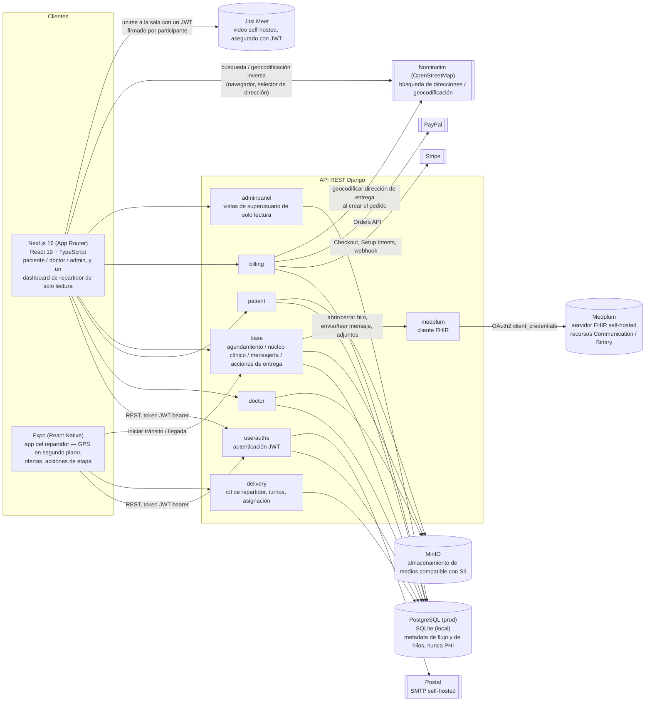
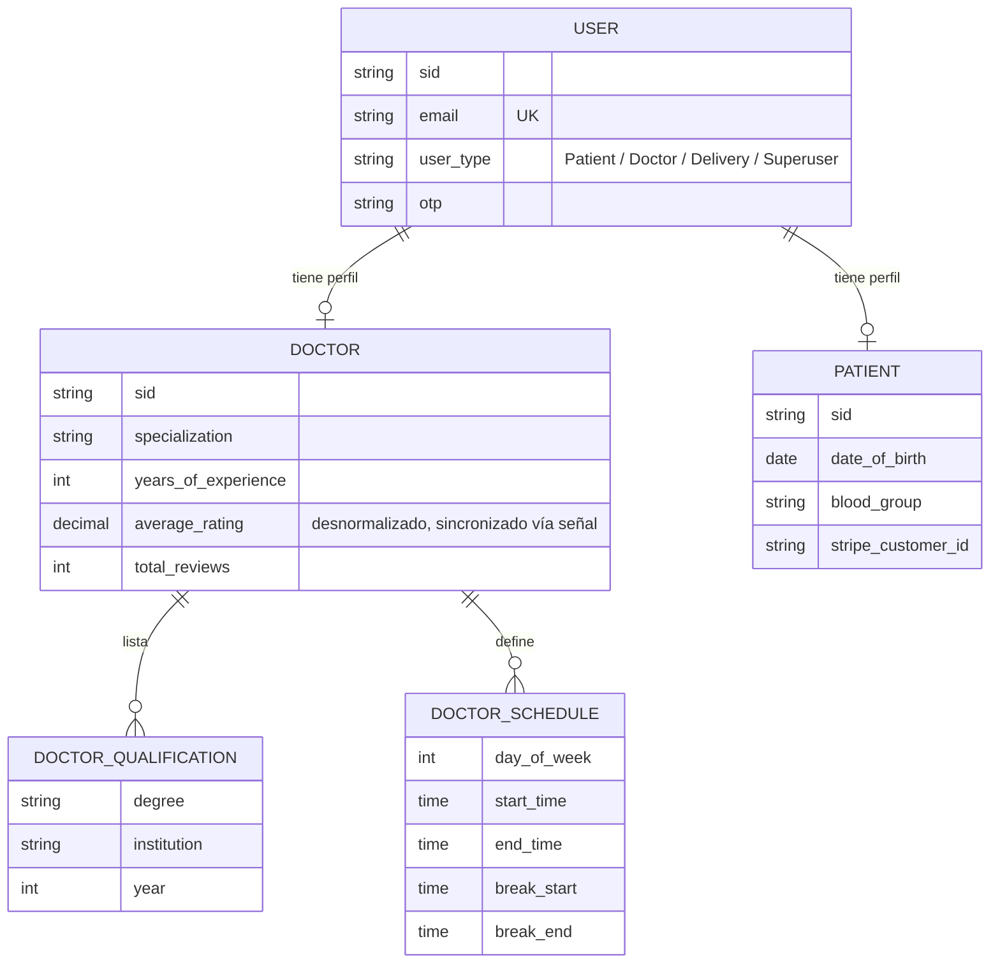
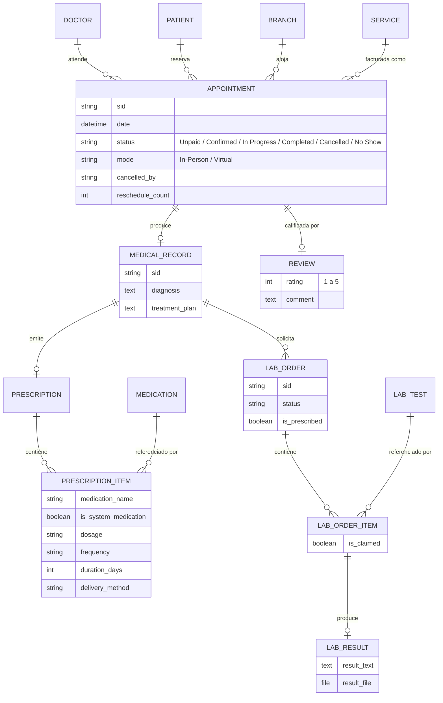
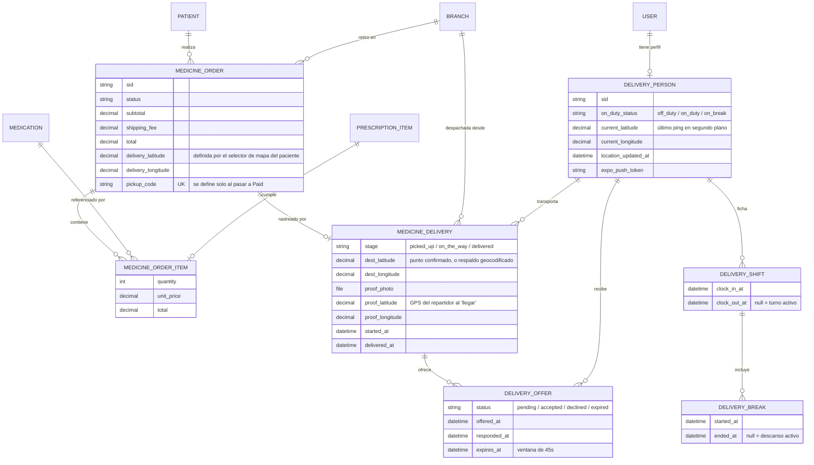
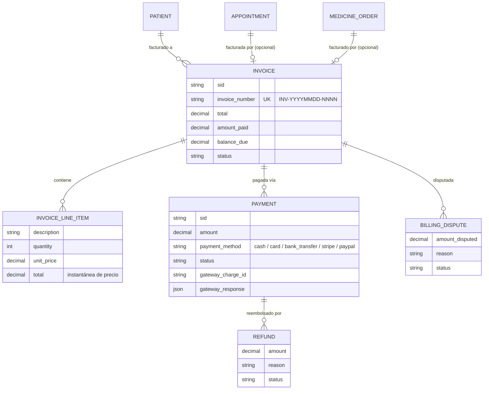
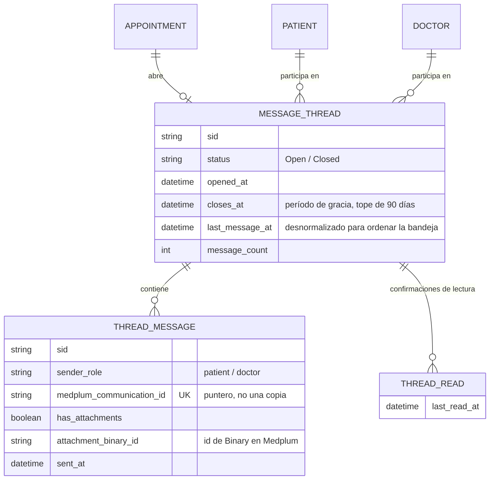

# CHOHEALTH

Una plataforma de salud full-stack que conecta pacientes y hospitales.

Idioma: [English](README.md) | **Español**


---

## Índice

1. [Planteamiento del problema](#planteamiento-del-problema)
2. [Decisiones arquitectónicas](#decisiones-arquitectónicas)
3. [Reglas de negocio](#reglas-de-negocio)
4. [Arquitectura del sistema](#arquitectura-del-sistema)
5. [Mensajería segura (Medplum)](#mensajería-segura-medplum)
6. [Seguimiento de entregas en tiempo real](#seguimiento-de-entregas-en-tiempo-real)
7. [Videoconsultas (Jitsi Meet)](#videoconsultas-jitsi-meet)
8. [Esquema de base de datos](#esquema-de-base-de-datos)
9. [Capacidades por rol](#capacidades-por-rol)
10. [Limitaciones conocidas y comportamiento simulado](#limitaciones-conocidas-y-comportamiento-simulado)
11. [Stack tecnológico](#stack-tecnológico)
12. [Roadmap](#roadmap)
13. [Puesta en marcha](#puesta-en-marcha)
14. [Agradecimientos](#agradecimientos)
15. [Aviso](#aviso)

---

## Planteamiento del problema

Reservar una cita médica, surtir una receta y pagar por la atención suelen ser tres experiencias desconectadas para un paciente: una llamada para agendar, un papel para la farmacia, y un portal aparte (o ninguno) para ver la factura. CHOHEALTH está construido para unificar ese flujo en un solo producto: el paciente reserva una cita, el doctor genera un historial médico y una receta durante la consulta, el paciente la surte a través de una farmacia integrada con seguimiento de entrega, y cada uno de esos pasos genera una factura consistente y auditable — todo en una sola sesión autenticada, en el idioma del paciente.

El objetivo de ingeniería detrás del proyecto no fue construir otro demo CRUD, sino practicar las partes del software de salud que no perdonan atajos: evitar que un doctor quede doble-reservado, mantener un libro contable que no pueda desviarse silenciosamente de la realidad, reconciliar dos pasarelas de pago distintas contra el mismo modelo de facturación, y hacer cumplir quién puede ver o hacer qué.

Este es un proyecto de portafolio activo, no un producto terminado — ver [Roadmap](#roadmap).

---

## Decisiones arquitectónicas

| Decisión | Justificación |
|---|---|
| Django + DRF para la API | ORM maduro con restricciones reales a nivel de base de datos (no solo validación en el serializer), y un admin completo (Jazzmin) que cubre herramientas internas/de staff sin construir una app de administración aparte. |
| `Invoice` polimórfica mediante dos campos uno-a-uno opcionales más un `CheckConstraint`, en lugar de una foreign key genérica | Mantiene integridad referencial y joins SQL normales sobre `Invoice.appointment` / `Invoice.medicine_order`, mientras que una restricción XOR a nivel de base de datos hace estructuralmente imposible facturar ambos objetivos — o ninguno — desde la misma factura, incluso si una vista futura tiene un bug. |
| Prevención de conflictos de reserva forzada a nivel de base de datos, no solo en la lógica de las vistas | Una restricción única condicional sobre `(doctor, fecha)` es la última línea de defensa contra una condición de carrera donde dos pacientes pagan por el mismo horario con milisegundos de diferencia. Las validaciones a nivel de aplicación corren primero para dar un error rápido y amigable; la restricción es lo que realmente garantiza corrección bajo concurrencia. |
| Checkout hospedado (Stripe Checkout, redirección de PayPal) como la vía de pago principal; Stripe Elements solo para tarjetas guardadas | El checkout hospedado mantiene el alcance de cumplimiento PCI-DSS del lado de la pasarela, no de la aplicación. Elements se usa de forma acotada, solo para el flujo (guardar una tarjeta para después) donde una redirección hospedada sería peor experiencia. |
| Un único webhook de Stripe compartido para citas y pedidos de farmacia, enrutado por metadata | Evita duplicar la verificación de firma del webhook y el manejo de eventos para dos tipos de entidad facturable; el modelo de factura/pago ya los trata de forma polimórfica, así que el webhook refleja eso. |
| El rol se guarda en el usuario (`user_type`) pero nunca se confía en él solo para autorización | Los permisos custom de DRF (`IsDoctor`, `IsPatient`) verifican el rol **y** que el objeto de perfil relacionado realmente exista. Un usuario que declara un rol sin un perfil correspondiente no está autorizado — cerrando un hueco que una verificación ingenua de `request.user.user_type == 'Doctor'` dejaría abierto. |
| Calificación del doctor desnormalizada, mantenida en sincronía vía señales | El listado/búsqueda de doctores es una ruta de lectura caliente; recalcular un promedio en cada request no escala conforme crecen las reseñas. Una señal `post_save`/`post_delete` sobre `Review` recalcula y persiste el agregado en su lugar. |
| Selección de base de datos dirigida por `DATABASE_URL` (PostgreSQL en producción vía `dj-database-url`, SQLite como fallback local) | Desarrollo local sin configuración y sin dependencias externas, base de datos de nivel producción en el despliegue sin tocar código. |
| MinIO (almacenamiento de objetos compatible con S3) como backend de medios | Self-hosted, compatible por API con el mismo backend S3 de `django-storages` que el código de producción usaría contra AWS S3 real — almacenamiento de archivos que se comporta igual en desarrollo local y en producción, sin depender de la cuota gratuita de un SaaS externo. |
| Postal (mailer self-hosted) para correo transaccional vía SMTP | Es dueño de todo el pipeline de entrega (SPF/DKIM, manejo de rebotes, un MTA real) sin depender de los límites de la capa gratuita de una API de terceros, en la misma infraestructura self-hosted que el resto de la plataforma. |
| Medplum (self-hosted, nativo en FHIR) para mensajería segura paciente-doctor, con Postgres guardando solo metadata | El contenido de los mensajes y los adjuntos son PHI y pertenecen a un sistema construido alrededor de los estándares de cifrado, control de acceso e interoperabilidad de FHIR, no atornillados a la base de datos propia de la app. Postgres (`MessageThread`/`ThreadMessage`) nunca guarda el cuerpo de un mensaje ni un archivo — solo participantes, marcas de tiempo y estado de lectura — de modo que la bandeja puede listar y ordenar sin un viaje de red a Medplum, y una caída de Medplum nunca pone en riesgo los datos propios de la app. Ver [Mensajería segura](#mensajería-segura-medplum). |
| Jitsi Meet self-hosted (asegurado con JWT) para las videollamadas de las citas virtuales, con el nombre de la sala derivado en vez de guardado | Sin SaaS de video de terceros, sin cobro por minuto, y nada que otorgue acceso a la sala vive en la base de datos — el nombre de la sala se recalcula del lado del servidor a partir del `sid` de la cita y una sal secreta en cada solicitud, de modo que conocer el `sid` (ya público) por sí solo no alcanza para entrar. Ver [Videoconsultas](#videoconsultas-jitsi-meet). |
| Wrapper nativo de `fetch` (`src/lib/api.ts`) en lugar de un cliente HTTP más pesado en el frontend | Un único lugar para adjuntar el token JWT, el header `Accept-Language`, y el manejo de multipart — sin dependencia adicional en tiempo de ejecución para lo que es una capa de API delgada y predecible. |
| Next.js App Router con árboles de rutas por rol (`/dashboard/doctor`, `/dashboard/patient`, `/dashboard/delivery`, `/dashboard/admin`) | El enrutamiento por sistema de archivos mapea directamente cada recorrido de usuario, muy distinto entre sí, y cada árbol de dashboard envía solo los componentes que su rol necesita. |
| Una app aparte en Expo (React Native) para el rol de repartidor, en vez de otra pestaña del navegador | El rastreo GPS en segundo plano, con la app minimizada o el teléfono bloqueado, es poco confiable o directamente imposible desde la API de Geolocation de un navegador, pero es una capacidad nativa de primera clase (tareas en segundo plano de `expo-location`). El dashboard web del repartidor es deliberadamente de solo lectura (historial, estadísticas, perfil) — toda acción que depende de la ubicación en vivo ocurre únicamente en la app nativa. Ver [Seguimiento de entregas en tiempo real](#seguimiento-de-entregas-en-tiempo-real). |
| Asignación de entregas y expiración de ofertas impulsadas enteramente por eventos reales (un pago exitoso, un repartidor que rechaza, una entrega que se completa), no por un worker programado | Consistente con el resto del código base (ver el circuit breaker de [Mensajería segura](#mensajería-segura-medplum) y el webhook de facturación) — este proyecto deliberadamente no tiene Celery ni cron en ninguna parte. Una oferta expirada se detecta de forma perezosa, la próxima vez que algo la lee o actúa sobre ella, en lugar de una tarea en segundo plano compitiendo contra el reloj. |
| Un pin en el mapa confirmado por el paciente (búsqueda + arrastre, como el selector de dirección de una app de comida a domicilio) en vez de geocodificar texto libre de dirección después del hecho | Geocodificar texto libre contra un servicio como Nominatim puede resolver silenciosamente con la precisión equivocada — todo un vecindario en vez de un edificio — sin ninguna señal visible de que eso ocurrió. Capturar la coordenada que el paciente realmente confirmó en un mapa es estrictamente más confiable que intentar recuperarla del texto después, y es sobre lo que están construidos tanto el geofence como el mapa en vivo del repartidor. |

---

## Reglas de negocio

Las reglas siguientes están implementadas en código (restricciones de modelo, validadores `clean()`, o clases de permisos), no solo descritas en documentación — cada una corresponde a una salvaguarda específica en el código fuente.

**Agendamiento**
- El estado clínico de una cita (`Unpaid`, `Confirmed`, `In Progress`, `Completed`, `Cancelled`, `No Show`) se rastrea de forma independiente de su estado de pago, que vive en la `Invoice` vinculada.
- Un doctor no puede tener dos citas en estado bloqueante (`Confirmed`, `In Progress`, `Completed`, `No Show`) en la misma fecha y hora — impuesto por una restricción única condicional a nivel de base de datos, de modo que los horarios `Unpaid` y `Cancelled` pueden coexistir o reintentarse libremente.
- Las citas virtuales no pueden tener una sede asignada; las citas presenciales deben tener una.
- Las cancelaciones registran quién canceló (paciente, doctor, admin o sistema) y por qué; las reprogramaciones conservan la fecha/hora original e incrementan un contador.
- Cuando un paciente cancela una cita pagada, el porcentaje de reembolso depende de cuánta anticipación dio: 100% con más de 48 horas de antelación, 50% entre 24 y 48 horas, 0% dentro de las 24 horas. Una cancelación iniciada por el doctor siempre reembolsa el 100%, sin importar la anticipación — el paciente nunca es penalizado por una decisión del doctor.
- El horario semanal de un doctor (`DoctorSchedule`) no tiene API de autoservicio — los bloques de horario se crean y editan exclusivamente desde el admin de Django. Un doctor puede leer su propio horario pero no modificarlo desde su dashboard (ver [Limitaciones conocidas](#limitaciones-conocidas-y-comportamiento-simulado)).

**Historiales clínicos y flujo de consulta**
- Se crea como máximo un historial médico por cita, y es el punto de anclaje de cualquier receta u orden de laboratorio ligada a esa consulta.
- Una línea de receta puede apuntar a un medicamento del catálogo o ser texto libre — un doctor no está limitado a recetar solo lo que existe en el formulario propio del hospital.
- Un doctor solo puede mover una cita a través de un grafo de estados fijo: `Confirmed` → `In Progress`, `Completed`, `Cancelled` o `No Show`; `In Progress` → `Completed` o `Cancelled`. Cualquier otra transición se rechaza.
- El enlace de reunión y la sala de Jitsi de una cita virtual se generan automáticamente en el momento en que el pago la confirma — nunca es algo que el doctor tenga que proporcionar a mano — y se emite un token de acceso por participante, por solicitud, solo dentro de una ventana de tiempo alrededor de la cita agendada (ver [Videoconsultas](#videoconsultas-jitsi-meet)).
- Cerrar una consulta es una sola acción atómica: crea el historial médico y, en la misma solicitud, opcionalmente una receta y/u orden de laboratorio juntos. No puede ejecutarse dos veces sobre la misma cita, y ninguno de esos tres registros puede editarse ni borrarse después vía API — desde la perspectiva de la API, el historial clínico de un paciente es de solo-agregar.

**Farmacia y cumplimiento de recetas**
- Los medicamentos y las pruebas de laboratorio declaran, cada uno de forma independiente, dos banderas: `requires_prescription` y `free_when_prescribed`. Si `requires_prescription` es `False`, el paciente puede comprar o reservar el artículo directamente, sin que intervenga ningún doctor. Si es `True`, el endpoint de compra/reserva exige un ítem de receta sin reclamar para ese medicamento o prueba exacta — emitido antes por un doctor a través de una cita completada (`MedicalRecord` → `Prescription`/`LabOrder`) — y devuelve `403` en caso contrario. No existe forma de obtener un artículo con receta obligatoria sin esa consulta previa.
- El precio de un artículo con receta obligatoria es `$0` únicamente cuando está respaldado por un ítem de receta sin reclamar **y** el registro del catálogo tiene `free_when_prescribed = True` (el valor por defecto); en cualquier otro caso el paciente paga el precio completo del catálogo, tenga o no receta.
- Un medicamento (o prueba de laboratorio) recetado puede reclamarse como máximo una vez entre todos los pedidos no cancelados — impuesto mediante un enlace uno-a-uno entre la línea del pedido y el ítem de receta origen, evitando que la misma receta se despache dos veces por rutas paralelas de retiro/entrega.
- El envío se cobra distinto según cuál de dos flujos de farmacia, no intercambiables entre sí, procese el pedido:
  - **Carrito de farmacia** (comprar medicamentos, recetados o no, uno a la vez): el envío es siempre gratis sin importar si se elige retiro o entrega a domicilio — el precio de cada artículo ya lo contempla. Reclamar un artículo recetado a `$0` desde el carrito con entrega a domicilio no cuesta nada en absoluto, envío incluido.
  - **Flujo dedicado "solicitar entrega"** (agrupa todos los medicamentos recetados sin reclamar de una receta en un solo pedido de entrega): siempre cobra una tarifa de envío fija además, sin importar si los medicamentos agrupados se cotizan en `$0` o a precio completo. Este es el único camino del sistema donde se cobra envío.
- El código de retiro de un pedido de farmacia se genera una sola vez, únicamente en el momento en que pasa a `Paid` (pago en línea o cubierto totalmente por una receta); permanece sin definir mientras el pago está pendiente, de modo que un pedido no pagado nunca puede retirarse en una sede.

**Entrega**
- El estado de turno de un repartidor (`off_duty` / `on_duty` / `on_break`) determina si el algoritmo de asignación siquiera lo considera candidato — un repartidor fuera de servicio o en descanso nunca recibe una oferta de entrega.
- Un repartidor no puede iniciar un descanso, ni marcar salida, mientras tiene una entrega activamente asignada (cualquier etapa anterior a `delivered`). Una entrega a la vez, de principio a fin, antes de que se permita el siguiente cambio de estado de turno.
- Una oferta de entrega expira 45 segundos después de generarse si el repartidor no responde; tanto un rechazo como una expiración escalan al siguiente repartidor disponible más cercano, nunca de vuelta a alguien que ya vio esa misma entrega.
- La verificación de geofence al "llegar" bloquea la confirmación por completo cuando el GPS del repartidor está claramente fuera de `MAX_GEOFENCE_METERS` (150m) del punto de entrega confirmado — la respuesta incluye la distancia real para que el repartidor sepa qué tan lejos está. Solo se omite el chequeo (nunca bloquea) cuando no hay ninguna coordenada de destino contra la cual comparar, en vez de dejar la entrega atascada por un tecnicismo.
- La prueba de entrega requiere tanto una foto como la posición GPS del repartidor en ese momento exacto — ninguna de las dos se acepta por separado.

**Reseñas**
- Una reseña solo puede enviarse para una cita con estado `Completed`, y solo por el paciente dueño de esa cita; ese mismo paciente puede editarla o borrarla después, y solo existe una reseña por cita.
- La visibilidad de las reseñas es pública, no está limitada al autor: cualquier paciente puede navegar un feed con todas las reseñas de todos los doctores, y las reseñas individuales de un doctor específico son legibles incluso por un visitante sin sesión iniciada. El catálogo de doctores que el paciente navega antes de agendar ya muestra la calificación promedio y el número de reseñas de cada doctor — se espera que el paciente elija por reputación antes de ser atendido, no que solo califique después.

**Facturación**
- Cada factura factura exactamente uno entre una cita o un pedido de farmacia — nunca ambos, nunca ninguno — impuesto con una restricción de verificación a nivel de base de datos.
- La numeración de facturas es secuencial por día calendario (`INV-YYYYMMDD-NNNN`).
- Las líneas de factura guardan una instantánea del precio al momento de facturar; cambios posteriores de precio en el servicio o medicamento subyacente nunca alteran facturas históricas.
- La suma de reembolsos completados contra un pago nunca puede exceder el monto original del pago.
- Cada pago conserva la respuesta cruda de la pasarela junto con un estado normalizado, de modo que la reconciliación nunca requiere volver a consultar soporte de Stripe o PayPal.

**Identidad y acceso**
- La autenticación es por correo electrónico, no por nombre de usuario; los nombres de usuario se derivan automáticamente y se deduplican con un sufijo numérico.
- El rol de un usuario (`Patient` / `Doctor` / `Delivery` / `Superuser`) es necesario pero no suficiente para autorización — el acceso también requiere que exista el objeto de perfil correspondiente (la excepción es `Superuser`, que se valida contra el flag propio de Django `is_superuser` en vez de un perfil).
- Los tokens de acceso expiran a los 30 minutos; los tokens de refresco a los 7 días, con rotación activada, de modo que un token de refresco capturado solo puede usarse una vez antes de invalidarse.

**Mensajería segura**
- Un hilo se abre automáticamente en el momento en que el pago de una cita se completa (es decir, pasa a `Confirmed`) — nunca al reservar, ni al registrarse — con una excepción: una visita exclusivamente de laboratorio o un servicio que no sea `Consultation` nunca genera un hilo, ya que no hay conversación con un doctor que tener.
- Completar una consulta otorga un período de gracia en vez de cerrar el hilo de inmediato: 14 días por defecto, extendido a 30 días si la consulta dejó pendiente una orden de laboratorio (aún no `Completed`/`Cancelled`) o cualquier receta por seguir — con un tope de 90 días desde que el hilo se abrió por primera vez, para que un resultado de laboratorio que nunca llega no mantenga el canal abierto indefinidamente.
- Cancelar la cita, por cualquiera de las dos partes, cierra su hilo de inmediato — sin período de gracia para una visita que nunca ocurrió.
- Un doctor también puede terminar la conversación manualmente en cualquier momento mediante una acción dedicada de "Terminar conversación", independiente del ciclo de vida propio de la cita.
- El contenido de los mensajes y los adjuntos viven en Medplum, nunca en la base de datos propia de CHOHEALTH — `ThreadMessage` solo guarda quién lo envió, cuándo, y un puntero para recuperar el contenido; el endpoint de listado de hilos deliberadamente excluye cualquier previsualización de mensaje, por la misma razón.
- Si Medplum no responde, un circuit breaker se activa tras 3 fallos consecutivos y los endpoints de mensajería responden `503` durante 60 segundos; el resto de funcionalidades (reservas, pagos, recetas) no se ven afectadas.

---

## Arquitectura del sistema



Cada app de Django es dueña de sus propios modelos y vistas, pero todas comparten una única base de datos PostgreSQL/SQLite; no hay una frontera de servicio entre ellas a nivel de datos, por diseño — esto es un monolito modular, no un sistema de microservicios, lo cual corresponde a la escala real del proyecto y evita pagar un costo de sistemas distribuidos que no necesita. Medplum es la excepción deliberada: es un servidor FHIR self-hosted separado, no otra tabla más en la misma base de datos, porque el contenido de los mensajes y los adjuntos son PHI que pertenece detrás de los estándares propios de FHIR y no dentro del esquema del monolito.

---

## Mensajería segura (Medplum)

CHOHEALTH antes no tenía ningún canal para que un paciente y un doctor se comunicaran fuera de una consulta agendada — lo más cercano era una `Notification` unidireccional y sin hilo. La mensajería segura cierra ese hueco usando [Medplum](https://github.com/medplum/medplum), una plataforma self-hosted, de código abierto y nativa en FHIR, en lugar de construir infraestructura de chat a medida que tendría que reinventar cifrado, control de acceso e interoperabilidad desde cero.

**Almacenamiento híbrido, por diseño.** Postgres y Medplum son dueños cada uno de una mitad distinta del problema, y ninguno es una caché del otro:
- **Postgres** (`MessageThread`, `ThreadMessage`, `ThreadRead`) guarda solo metadata de flujo — quién participa en el hilo, cuándo se abre/cierra, contadores de no leídos, marcas de tiempo. Esto es lo que permite listar, ordenar y paginar la bandeja sin una llamada de red a Medplum en cada carga de página.
- **Medplum** guarda todo lo que realmente es PHI — el texto del mensaje y cualquier adjunto — como recursos FHIR `Communication` y `Binary`. `ThreadMessage.medplum_communication_id` es un puntero, no una copia; el contenido se obtiene de Medplum bajo demanda, y el endpoint de listado de bandeja deliberadamente nunca incluye una previsualización del mensaje.

**Ciclo de vida atado a la necesidad clínica, no a un calendario fijo.** La ventana de escritura de un hilo no es "N días después del checkout" — rastrea si todavía existe una razón plausible para seguir hablando (ver [Reglas de negocio](#reglas-de-negocio) para las reglas exactas del período de gracia), y un doctor también puede cerrar una conversación manualmente en cualquier momento.

**Los adjuntos nunca exponen Medplum directamente.** Un archivo se sube a un recurso `Binary` de Medplum y se referencia desde el payload del `Communication`; las descargas se sirven a través de un proxy de Django (`ThreadAttachmentDownloadView`), que obtiene los bytes del lado del servidor, de modo que un cliente nunca recibe — ni necesita — una URL directa y potencialmente de larga duración de Medplum.

**Degradación controlada.** `MEDPLUM_ENABLED=False` (el valor por defecto) desactiva la función de forma limpia sin impacto en el resto de la app; con la función activada, un circuit breaker aísla una caída de Medplum solo a los endpoints de mensajería (ver [Reglas de negocio](#reglas-de-negocio)).

---

## Seguimiento de entregas en tiempo real

La entrega de farmacia solía estar simulada — `MedicineDelivery.stage` avanzaba a través de 5 etapas fijas por temporizador, calculadas a partir del tiempo transcurrido en cada consulta, sin repartidor, sin GPS, y sin ningún evento del mundo real que la impulsara. Ahora es una entrega real rastreada de punta a punta: un tercer rol de usuario (`Delivery`), un algoritmo de asignación basado en proximidad, una app nativa complementaria para el repartidor, y un mapa en vivo para el paciente.

**Por qué una app nativa en vez de otro dashboard web.** El único requisito difícil — que la posición del repartidor se siga actualizando con la app en segundo plano o el teléfono bloqueado — no es algo que una pestaña de navegador pueda hacer de forma confiable. La API de tareas en segundo plano de `expo-location` sí puede. El dashboard web del repartidor (`/dashboard/delivery`) sigue existiendo, pero deliberadamente no hace nada que dependa de la ubicación en vivo: es historial, estadísticas y perfil de solo lectura. Toda acción que necesita GPS — marcar entrada, recibir una oferta, marcar una entrega en tránsito o como llegada — ocurre en la app de Expo.

**Asignación: ordenada por proximidad, una oferta a la vez, sin worker programado.**
1. En el instante en que se paga un pedido con modalidad de entrega, `try_assign()` se ejecuta (vía `transaction.on_commit`, de modo que solo dispara una vez que el pago está realmente confirmado) y ordena a todos los repartidores en servicio y libres por distancia haversine a la sede de retiro.
2. El candidato más cercano recibe un `DeliveryOffer` con una ventana de 45 segundos y, cuando el push de EAS está configurado, una notificación push; mientras tanto (o como respaldo de resiliencia), la app del repartidor consulta si hay una oferta pendiente cada 5 segundos.
3. Un rechazo, o que se agoten los 45 segundos, escala al siguiente repartidor más cercano que aún no haya visto esa entrega exacta — nunca de vuelta a alguien que ya la rechazó o dejó expirar.
4. Si nadie está disponible, la entrega simplemente queda sin asignar; el mismo `try_assign()` se vuelve a ejecutar automáticamente la próxima vez que algún repartidor queda libre (termina una entrega) o una oferta se rechaza o expira. No hay Celery ni cron en ningún punto de este flujo, consistente con el resto del código base (ver [Reglas de negocio](#reglas-de-negocio)) — cada disparador es un evento real, y una oferta obsoleta se trata como expirada de forma perezosa, la próxima vez que se lee o se actúa sobre ella.

**El selector de dirección reemplaza la geocodificación a ciegas.** El plan original geocodificaba la dirección de entrega en texto libre del paciente después del hecho (vía Nominatim). En la práctica esto falló en silencio exactamente de la forma que cabría esperar: una dirección de calle específica que no podía resolverse con precisión terminaba emparejándose con todo el vecindario circundante — una coordenada que *parecía* precisa pero estaba desviada casi un kilómetro, descubierto literalmente parado en el punto resuelto y viendo cómo el geofence reportaba "estás lejos". La solución fue dejar de adivinar después del hecho: ahora el paciente confirma un punto exacto en un mapa (búsqueda mientras escribe vía Nominatim, o arrastrar/tocar un pin directamente — el mismo patrón que el checkout de una app de comida a domicilio) al momento de hacer el pedido, y esa coordenada confirmada es lo que usan tanto el mapa en vivo del repartidor como la verificación de geofence al "llegar". El backend todavía geocodifica como respaldo para cualquier pedido que de algún modo se salte el selector, pero ahora descarta un resultado que no tenga al menos precisión de nivel de calle (`place_rank`) en vez de aceptar una estimación a nivel de vecindario.

**Qué hace la app del repartidor** (`mobile/`, Expo Router + TypeScript):
- Marcar entrada/salida y descansos, bloqueado mientras tiene una entrega activamente asignada (ver [Reglas de negocio](#reglas-de-negocio)).
- Ping de GPS en segundo plano cada ~12 segundos mientras está en servicio, sin importar si hay una entrega activa — el ordenamiento por proximidad necesita una posición incluso para un repartidor libre.
- Aceptar/rechazar una oferta con una cuenta regresiva en vivo.
- Dos acciones de etapa: "Iniciar tránsito" (este es el momento en que el mapa del paciente se activa) y "Marcar llegada" (requiere una foto del paquete entregado más la posición GPS del repartidor en ese instante — ambas juntas son la prueba de entrega, ninguna por separado).
- Una advertencia de geofence suave y no bloqueante si la posición del repartidor no coincide lo suficiente con el punto de entrega confirmado — de todas formas completa la entrega, ya que una lectura de GPS puede legítimamente tener margen de error.

**Qué ve el paciente.** La página de seguimiento se mantiene como un stepper de solo texto (`picked_up` → `on_the_way` → `delivered`) hasta que el repartidor inicia el tránsito — sin mapa, no hay nada que mostrar todavía. Una vez que está en camino, aparece un mapa en vivo (`react-leaflet` + tiles de OpenStreetMap, sin API key) con la posición del repartidor y el pin de entrega confirmado; si el último ping del repartidor se vuelve obsoleto (>60s), la interfaz lo dice explícitamente ("última ubicación conocida hace N minutos") en vez de dejar el pin congelado en su lugar sin avisar.

**Lo que sigue siendo un hueco conocido, no una limitación de diseño:** la app de Expo todavía no está vinculada a un proyecto de EAS, así que las notificaciones push no están activas en producción — el polling cada 5 segundos en la pantalla principal del repartidor es el respaldo y hace que la app sea completamente usable sin push, solo que no instantánea. Configurar `eas build`/`eas submit` para tener una app instalable de verdad (en vez de Expo Go) es el siguiente paso natural.

---

## Videoconsultas (Jitsi Meet)

Una cita virtual solía ser virtual solo de nombre: el campo `Appointment.meeting_link` existía desde el primer día, pero nada lo llenaba nunca — el doctor tenía que ir a crear una sala en una herramienta externa y pegar la URL a mano antes de poder iniciar la llamada, sin ninguna verificación de que el enlace siquiera funcionara. Ahora es una videollamada real y self-hosted: [Jitsi Meet](https://github.com/jitsi/docker-jitsi-meet), desplegado en la misma VPS que el resto de la plataforma, con la sala generada y asegurada automáticamente.

**El enlace se genera en el momento en que el pago confirma la cita, no cuando empieza la llamada.** `ensure_meeting_link()` corre dentro de la misma transacción atómica que pasa una cita pagada a `Confirmed` (`billing/payment_views.py`) — sin depender de que el doctor se acuerde de hacer algo, y sin depender de red de que Jitsi esté disponible en ese instante, ya que generar el enlace es puro cómputo local (ver el siguiente punto). Tanto el paciente como el doctor ven un botón "Unirse a la consulta" en la cita apenas queda pagada, mucho antes de que empiece la visita.

**El enlace guardado es una URL de CHOHEALTH, no una URL de Jitsi — a propósito.** Jitsi está configurado con autenticación JWT (`ENABLE_AUTH=1`, `AUTH_TYPE=jwt`, invitados deshabilitados), así que nadie puede entrar a una sala sin un token firmado válido, aunque tenga la URL en mano — lo cual significa que un enlace directo a Jitsi dejaría de funcionar en cuanto la autenticación está activa: siempre necesita un token firmado, fresco y por usuario, agregado al final, y un token es algo malo para guardar en una columna de base de datos, ya que expira y está atado a una sola identidad. Por eso `meeting_link` en realidad apunta a `/join/<sid>` en el frontend de CHOHEALTH; esa página autentica al visitante, confirma que es el paciente o el doctor de esa cita específica, y solo entonces llama a `GET /appointments/<sid>/meeting-token/` para generar un token de corta duración (2 horas) y redirigir directo a la sala.

**Los nombres de sala se derivan, nunca se guardan.** La sala de Jitsi propiamente es `cho-<hmac-sha256(appointment.sid)[:32]>`, calculada bajo demanda a partir de una sal del lado del servidor en vez de persistida en algún lado — de modo que el `sid` público de la cita, que ya aparece en URLs y payloads de la API, nunca se reutiliza como algo que por sí solo otorgue acceso. Conocer el sid no lleva a ningún lado sin además tener un token firmado y vigente.

**Quién puede entrar, y cuándo.** El endpoint del token verifica tres cosas antes de firmar nada: que quien solicita es el paciente o el doctor de esa cita exacta (`403` en caso contrario), que la cita está `Confirmed` o `In Progress` (no `Cancelled`, `Completed`, ni todavía `Unpaid`), y que la hora actual cae dentro de una ventana alrededor del horario agendado — 15 minutos antes, durante la duración del servicio, más 60 minutos de margen después. Fuera de esa ventana el endpoint devuelve `403` con un timestamp `available_from` en vez de un token, y la página de unión muestra eso en vez de un botón muerto. El doctor siempre entra a la sala como moderador de Jitsi; el paciente nunca.

**Lo que sigue siendo un hueco conocido:** el correo de confirmación de la cita todavía no lleva el enlace de la reunión — solo lo lleva el correo de "consulta virtual iniciada", que se dispara cuando el doctor pasa la cita a `In Progress` (ver la tabla de notificaciones en [Capacidades por rol](#capacidades-por-rol)). El enlace ya es visible en la app mucho antes de que ese correo se dispare, así que es un hueco más pequeño de lo que suena, pero un siguiente paso natural.

---

## Esquema de base de datos

El esquema se divide en cuatro diagramas que reflejan las apps de Django, para mantener cada uno legible. Las claves primarias son IDs cortos tipo UUID (`sid`) expuestos por la API; los IDs numéricos permanecen internos.

### Identidad y equipo de atención



### Agendamiento e historiales clínicos



### Farmacia y entregas



### Facturación



`Invoice.appointment` e `Invoice.medicine_order` son ambos campos uno-a-uno opcionales; una restricción `CheckConstraint` a nivel de base de datos exige que exactamente uno de los dos esté definido, algo que un diagrama entidad-relación no puede expresar directamente — está impuesto en `billing/models.py`, no solo en el código de la aplicación.

### Mensajería segura



Nota lo que falta: ningún cuerpo de mensaje, ningún archivo, ningún campo de `THREAD_MESSAGE` que guarde algo que un paciente o doctor realmente haya escrito. Ese contenido existe únicamente como recursos FHIR en Medplum — esta tabla es incapaz de filtrar PHI de forma deliberada, incluso si se volcara toda la base de datos de Postgres.

---

## Capacidades por rol

### Paciente

- **Cuenta**: registro, inicio de sesión, edición de perfil (contacto, datos demográficos, foto), panel de estadísticas propio (citas, historiales, resultados de laboratorio, notificaciones sin leer).
- **Citas**: navegar el catálogo público de servicios/doctores (visible incluso sin sesión), reservar presencial o virtual, pagar de inmediato o después, listar sus propias citas, reprogramar gratis contra el horario en vivo del doctor, cancelar con reembolso escalonado según anticipación, o eliminar directamente mientras siga sin pagar.
- **Historial clínico**: acceso de solo lectura a sus propios historiales médicos, recetas y órdenes/resultados de laboratorio; descarga de PDFs de receta y orden de laboratorio bajo demanda.
- **Farmacia**: navegar el catálogo público de medicamentos de venta libre, comprar medicamentos —recetados o no— mediante un carrito que soporta retiro o entrega a domicilio, o agrupar todas las medicinas recetadas pendientes en una sola solicitud de entrega dedicada.
- **Pruebas de laboratorio**: navegar el catálogo público de laboratorios (marcado con una insignia "gratis para ti" cuando existe una receta sin reclamar que coincide), reservar un laboratorio directo cuando no requiere receta, o gratis contra una que sí la requiere.
- **Seguimiento de entregas**: listar todos los pedidos en modalidad entrega y consultar un rastreador en vivo por pedido — un stepper de solo texto hasta que el repartidor inicia el tránsito, y luego un mapa en vivo con la posición del repartidor y el pin de entrega confirmado (ver [Seguimiento de entregas en tiempo real](#seguimiento-de-entregas-en-tiempo-real)).
- **Pagos**: checkout con Stripe/PayPal, gestión de tarjetas guardadas, historial y totales de pagos propios.
- **Reseñas**: calificar y comentar sobre cualquier doctor a partir de una cita completada (una por cita, editable), y por separado navegar un feed público con todas las reseñas de todos los doctores, o las de un doctor específico — no limitado a lo que el propio paciente haya enviado.
- **Mensajería segura**: escribirle al doctor desde el hilo de una cita confirmada (o completada recientemente), ver contadores de no leídos, y enviar adjuntos de imagen/PDF — ver [Mensajería segura](#mensajería-segura-medplum).
- **Notificaciones**: listar, filtrar por leído/no leído, marcar como leída, borrar.

### Doctor

- **Perfil**: editar su perfil y biografía; agregar o eliminar cualificaciones (título, institución, año, certificado).
- **Disponibilidad**: leer su propio horario semanal vía API. Los bloques de horario en sí solo se gestionan actualmente desde el admin de Django, sin autoservicio (ver [Limitaciones conocidas](#limitaciones-conocidas-y-comportamiento-simulado)).
- **Agenda**: listar y filtrar sus citas por fecha/mes; ver el detalle completo de una cita, incluyendo contacto y datos demográficos del paciente.
- **Flujo de consulta**: llevar una cita a través de `Confirmed → In Progress → Completed` (o `Cancelled`/`No Show`); cerrar una consulta en una sola acción atómica que crea el historial médico y, opcionalmente, una receta y/u orden de laboratorio juntos (ver [Reglas de negocio](#reglas-de-negocio)).
- **Cancelar/reprogramar**: cancelar una cita confirmada (siempre con reembolso completo al paciente) o reprogramarla contra su propio horario en vivo.
- **Pagos y estadísticas**: ver sus propios pagos recibidos y estadísticas de ingresos; un dashboard que resume número de citas, número de pacientes, calificación promedio, cantidad de reseñas, ingresos y notificaciones sin leer.
- **Reseñas**: leer sus propias reseñas vía el endpoint público por doctor; no puede responder, editar ni borrar una reseña de un paciente.
- **Mensajería segura**: la misma vista de hilo desde el lado del doctor, más la posibilidad de terminar una conversación manualmente antes de que expire su período de gracia.
- **Notificaciones**: listar, filtrar, marcar como leída, borrar.

### Delivery (repartidor)

- **Cuenta**: registro, inicio de sesión — solo desde la app de Expo (el login web rechaza una cuenta que no sea de repartidor, y viceversa; ver [Seguimiento de entregas en tiempo real](#seguimiento-de-entregas-en-tiempo-real)).
- **Turno**: marcar entrada/salida, iniciar/terminar un descanso — bloqueado mientras tiene una entrega activamente asignada (ver [Reglas de negocio](#reglas-de-negocio)).
- **Ofertas**: recibir una oferta de entrega (push, o el polling propio de la app), aceptar o rechazar contra una cuenta regresiva en vivo.
- **Entrega activa**: marcar una entrega recogida como "en tránsito" (esto es lo que activa el mapa del paciente), y luego como "llegada" con una foto de prueba y posición GPS.
- **Dashboard web** (`/dashboard/delivery`, de solo lectura): estadísticas de turno (entregas de hoy/completadas, tiempo promedio), historial de entregas, perfil — ninguna acción aquí depende de la ubicación en vivo, por diseño.

### Superuser (Admin)

- **Dashboard web** (`/dashboard/admin`, de solo lectura por ahora): todos los usuarios de todos los roles con su información básica de perfil, todas las entregas de toda la plataforma, y un historial de entregas por usuario (como el paciente que las recibió, o el repartidor que las hizo).
- Todo lo demás — crear doctores/pacientes, editar catálogos, asignar horarios — sigue pasando por el admin de Django (Jazzmin); extender el dashboard del frontend para cubrir eso está en el [Roadmap](#roadmap).

### Notificaciones por correo (Postal, SMTP self-hosted)

Cada correo transaccional es de "disparar y olvidar" — un envío fallido queda registrado en el log pero nunca bloquea la solicitud — y todos comparten una misma plantilla con marca. Existen ocho disparadores distintos de punta a punta:

| Disparador | Se envía cuando | Adjunto |
|---|---|---|
| Reset de contraseña | Se solicita un reset | — |
| Cita confirmada | El pago de una cita se completa | PDF de factura |
| Cita cancelada | Cualquiera de las dos partes cancela | — |
| Cita reprogramada | Cualquiera de las dos partes reprograma | — |
| Consulta virtual iniciada | El doctor marca la cita virtual como `In Progress` | Enlace de videollamada |
| Pedido de farmacia listo para retiro | Se paga un pedido con modalidad retiro | Código QR de retiro, PDF de factura |
| Pedido de farmacia enviado | Se paga un pedido con modalidad entrega | PDF de factura, enlace de seguimiento |
| Entrega completada | El repartidor marca una entrega como "llegada" | — |

Actualmente no existe correo de bienvenida al registrarse ni de "resultados de laboratorio listos" — ambos son adiciones naturales, todavía no construidas.

---

## Limitaciones conocidas y comportamiento simulado

Siendo transparente sobre qué es una simplificación deliberada de alcance de demo y qué es una integración real:

- **La disponibilidad del doctor todavía no tiene API de autoservicio.** El horario semanal de un doctor (`DoctorSchedule`) actualmente solo puede crearse o editarse desde el admin de Django — no existe un endpoint de "gestionar mi disponibilidad" en el propio dashboard del doctor.
- **La mensajería segura necesita una instancia de Medplum corriendo para poder enviar mensajes de verdad.** `MEDPLUM_ENABLED=False` (el valor por defecto) desactiva la función de forma limpia — reservas, pagos e historiales clínicos se comportan igual en ambos casos — pero con la función activada, una caída de Medplum sí se manifiesta como un `503` específicamente en los endpoints de mensajería (ver [Mensajería segura](#mensajería-segura-medplum)).
- **La app del repartidor todavía no está vinculada a un proyecto de EAS**, así que las notificaciones push para las ofertas de entrega no están activas — el propio polling de la app cada 5 segundos es el respaldo y la mantiene completamente usable mientras tanto (ver [Seguimiento de entregas en tiempo real](#seguimiento-de-entregas-en-tiempo-real)).
- **El dashboard de administración es de solo lectura.** Crear doctores/pacientes, editar el catálogo y asignar horarios todavía requiere el admin de Django (Jazzmin) — el dashboard del frontend por ahora solo lista usuarios y entregas.

---

## Stack tecnológico

| Capa | Tecnología |
|---|---|
| Backend | Django 6, Django REST Framework, `djangorestframework-simplejwt` |
| Base de datos | PostgreSQL (producción, vía `dj-database-url`), SQLite (fallback local) |
| Almacenamiento de medios | MinIO (compatible con S3, self-hosted) |
| Mensajería segura | Medplum (self-hosted, nativo en FHIR) |
| Archivos estáticos | Whitenoise |
| Panel de administración | Django Jazzmin |
| Pagos | Stripe (Checkout, Setup Intents, webhooks), PayPal (Orders API) |
| Correo | Postal (SMTP self-hosted) |
| Frontend | Next.js 16 (App Router), React 19, TypeScript |
| UI | shadcn/ui, `@base-ui/react`, Tailwind CSS v4, Framer Motion |
| i18n | `next-intl` (español/inglés) |
| Móvil (app del repartidor) | Expo (Expo Router), React Native, TypeScript |
| Mapa en vivo | `react-leaflet` + tiles de OpenStreetMap (sin API key) |
| Geocodificación / búsqueda de direcciones | Nominatim (OpenStreetMap, sin API key) |

---

## Roadmap

- **Sincronización estructurada de recursos FHIR**, extendiendo la integración de Medplum más allá de la mensajería — reflejar citas, recetas y órdenes de laboratorio como recursos FHIR (`Encounter`, `MedicationRequest`, `ServiceRequest`) vía un outbox de escritura diferida, manteniendo a Postgres como fuente de verdad en todo momento.
- Un endpoint de gestión de horario para el doctor, para que la disponibilidad semanal ya no dependa del admin de Django.
- **EAS build/submit para la app del repartidor**, para que sea una app instalable de verdad con notificaciones push funcionando, en vez de correr por Expo Go con un respaldo de polling (ver [Seguimiento de entregas en tiempo real](#seguimiento-de-entregas-en-tiempo-real)).
- **CRUD completo desde el dashboard de administración** — crear doctores y pacientes, editar el catálogo, asignar horarios — actualmente todavía exclusivo del admin de Django (ver [Capacidades por rol](#capacidades-por-rol)).
- Un modelo de pago/liquidación para doctores — cómo se les paga a los propios doctores por las citas completadas — diseñado pero todavía no construido.

---

## Puesta en marcha

### Requisitos previos

- Python 3.13+ (el `venv` incluido usa 3.14)
- Node.js 18.18+ (se recomienda 20+, por Next.js 16)
- Claves de API de Stripe y PayPal
- Un almacenamiento de objetos compatible con S3 para medios (MinIO o AWS S3)
- Un servidor SMTP para correo transaccional (self-hosted [Postal](https://github.com/postalserver/postal) en producción; cualquier SMTP funciona en local)
- Una instancia de [Medplum](https://github.com/medplum/medplum) para mensajería segura — opcional en local, la función se desactiva de forma limpia con `MEDPLUM_ENABLED=False` (ver [Limitaciones conocidas](#limitaciones-conocidas-y-comportamiento-simulado))
- Una instancia self-hosted de [Jitsi Meet](https://github.com/jitsi/docker-jitsi-meet) con autenticación JWT configurada, para las videoconsultas — `JITSI_APP_SECRET` solo necesita coincidir con lo configurado en tu despliegue de Jitsi (ver [Videoconsultas](#videoconsultas-jitsi-meet))
- PostgreSQL (opcional en local — usa SQLite como fallback si `DATABASE_URL` no está definida)

### Backend

```powershell
cd backend\CHOHEALT_BACK

python -m venv venv
.\venv\Scripts\Activate.ps1

pip install -r requirements.txt

# crear backend\CHOHEALT_BACK\.env — ver variables abajo

python manage.py migrate
python manage.py createsuperuser   # opcional, para /admin
python manage.py runserver
```

API disponible en `http://127.0.0.1:8000/api/`, admin en `http://127.0.0.1:8000/admin/`.

`backend/CHOHEALT_BACK/.env`:

```
SECRET_KEY=
DEBUG=True
ALLOWED_HOSTS=
CORS_ALLOWED_ORIGINS=http://localhost:3000
FRONTEND_URL=http://localhost:3000

DATABASE_URL=                 # opcional; usa SQLite local como fallback
DATABASE_NAME=
DATABASE_USER=
DATABASE_PASSWORD=
DATABASE_HOST=
DATABASE_PORT=

AWS_ACCESS_KEY_ID=
AWS_SECRET_ACCESS_KEY=
AWS_STORAGE_BUCKET_NAME=
AWS_S3_ENDPOINT_URL=           # ej. https://minio.ejemplo.com
AWS_S3_REGION_NAME=us-east-1

STRIPE_SECRET_KEY=
STRIPE_WEBHOOK_SECRET=

PAYPAL_CLIENT_ID=
PAYPAL_CLIENT_SECRET=
PAYPAL_MODE=sandbox            # o "live"

EMAIL_HOST=
EMAIL_PORT=25
EMAIL_USE_TLS=False
EMAIL_HOST_USER=
EMAIL_HOST_PASSWORD=
DEFAULT_FROM_EMAIL=

MEDPLUM_ENABLED=False           # poner True cuando haya una instancia de Medplum accesible
MEDPLUM_BASE_URL=
MEDPLUM_CLIENT_ID=
MEDPLUM_CLIENT_SECRET=

JITSI_BASE_URL=                 # ej. https://meet.ejemplo.com
JITSI_APP_ID=
JITSI_APP_SECRET=               # debe coincidir con el JWT_APP_SECRET de tu despliegue de Jitsi
JITSI_JWT_AUDIENCE=jitsi
JITSI_JWT_SUB=                  # tu dominio de Jitsi
JITSI_JWT_TTL_MINUTES=120
```

### Frontend

```powershell
cd frontend
npm install
```

`frontend/.env`:

```
NEXT_PUBLIC_API_URL=http://localhost:8000/api
NEXT_PUBLIC_STRIPE_PUBLISHABLE_KEY=
NEXT_PUBLIC_PAYPAL_CLIENT_ID=
```

```powershell
npm run dev
```

Frontend disponible en `http://localhost:3000`. Ejecuta backend y frontend en dos terminales — el frontend depende de la API para todo (autenticación, citas, pagos, etc.).

### Móvil (app del repartidor)

Solo es necesario para correr el lado nativo del rol de repartidor — la app web funciona completa sin esto.

```powershell
cd mobile
npm install
```

`mobile/.env`:

```
EXPO_PUBLIC_API_URL=http://localhost:8000/api
```

```powershell
npx expo start
```

Ábrela en [Expo Go](https://expo.dev/go) en un dispositivo físico — la ubicación en segundo plano y la cámara no funcionan de forma confiable en un simulador/emulador, y las notificaciones push necesitan un proyecto de EAS (todavía no configurado; el respaldo de polling propio de la app la mantiene usable de todas formas — ver [Seguimiento de entregas en tiempo real](#seguimiento-de-entregas-en-tiempo-real)).

---

## Agradecimientos

La mensajería segura paciente-doctor de CHOHEALTH está construida sobre [Medplum](https://www.medplum.com/) ([github.com/medplum/medplum](https://github.com/medplum/medplum)), una plataforma de salud de código abierto y nativa en FHIR, self-hosted para este proyecto. Los recursos FHIR `Communication` y `Binary` de Medplum hacen el trabajo real de almacenamiento conforme a estándares para el contenido de los mensajes y los adjuntos — exactamente la propiedad que esta integración necesitaba, y no algo que valiera la pena reinventar desde cero. Crédito al equipo de Medplum y a su comunidad de código abierto por construirlo y mantenerlo.

El resto de la infraestructura self-hosted de este proyecto también se apoya en código abierto: [MinIO](https://min.io/) para almacenamiento de medios compatible con S3, y [Postal](https://github.com/postalserver/postal) para correo transaccional — elegidos por la misma razón que Medplum: bloques de construcción maduros por encima de soluciones a medida.

El mapa en vivo y la búsqueda de direcciones del seguimiento de entregas corren enteramente sobre el proyecto [OpenStreetMap](https://www.openstreetmap.org/copyright) — tiles de mapa y geocodificación vía su servicio [Nominatim](https://nominatim.org/), renderizados con [Leaflet](https://leafletjs.com/)/[react-leaflet](https://react-leaflet.js.org/) — gratis, sin API key, mantenido por su comunidad de colaboradores voluntarios. La app nativa del repartidor está construida sobre [Expo](https://expo.dev/), cuyo tooling administrado de React Native (en particular, la API de tareas en segundo plano de `expo-location`) es lo que hace práctico el rastreo GPS real en segundo plano sin tener que construir módulos nativos a mano por separado para iOS y Android.

---

## Aviso

Este es un proyecto de portafolio y aprendizaje que demuestra ingeniería full-stack y lógica de negocio del dominio de salud. No es software médico certificado y no está pensado para manejar datos reales de pacientes en producción sin trabajo de cumplimiento normativo adicional.
