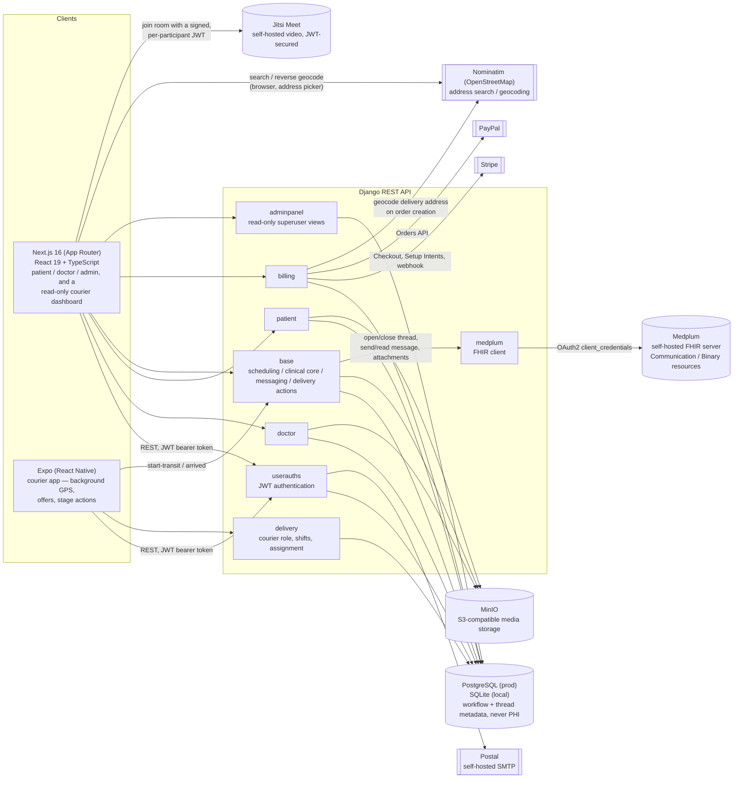
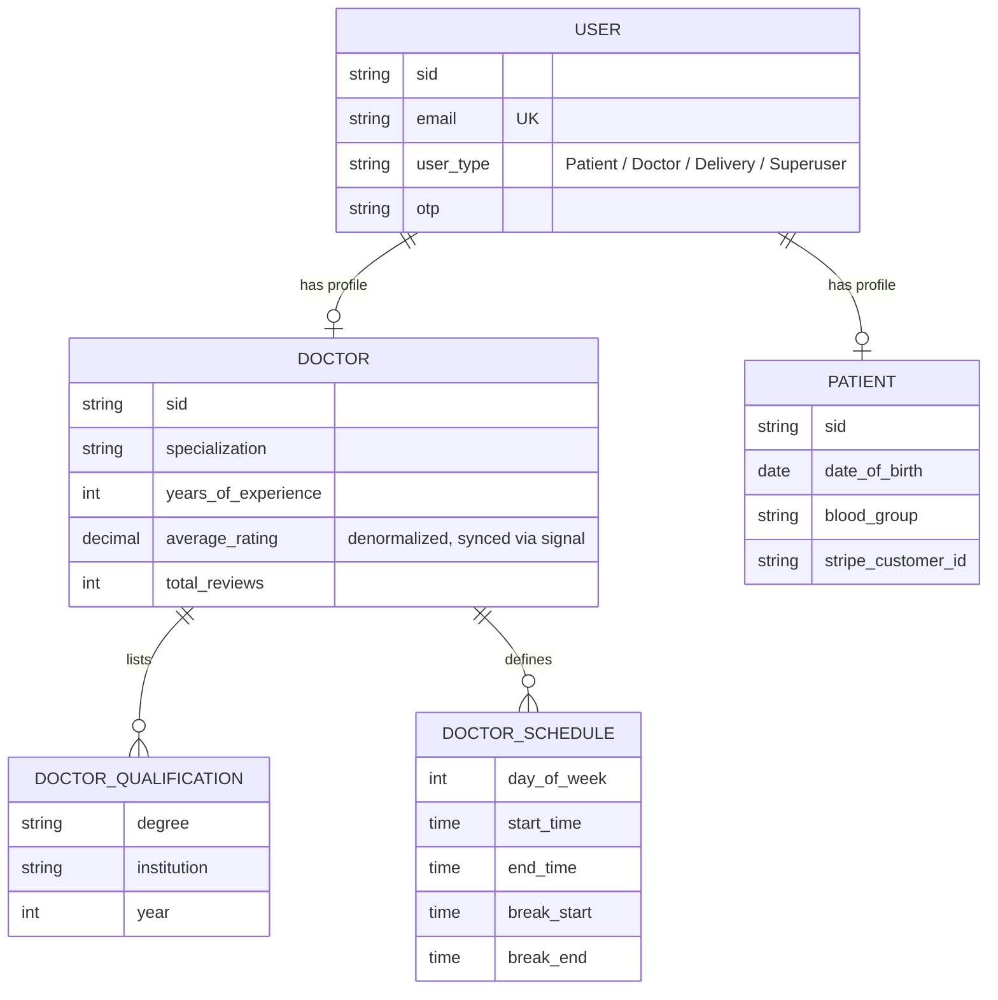
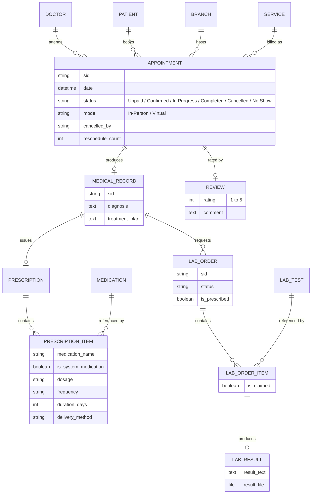
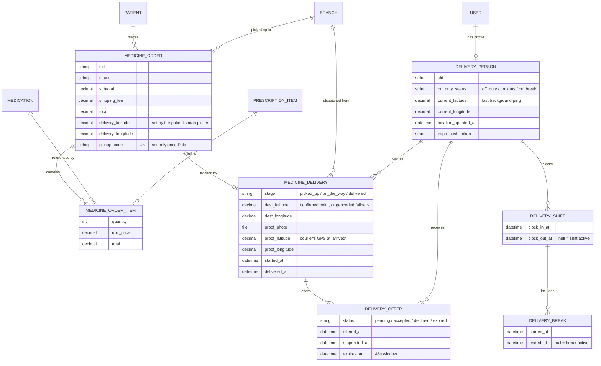
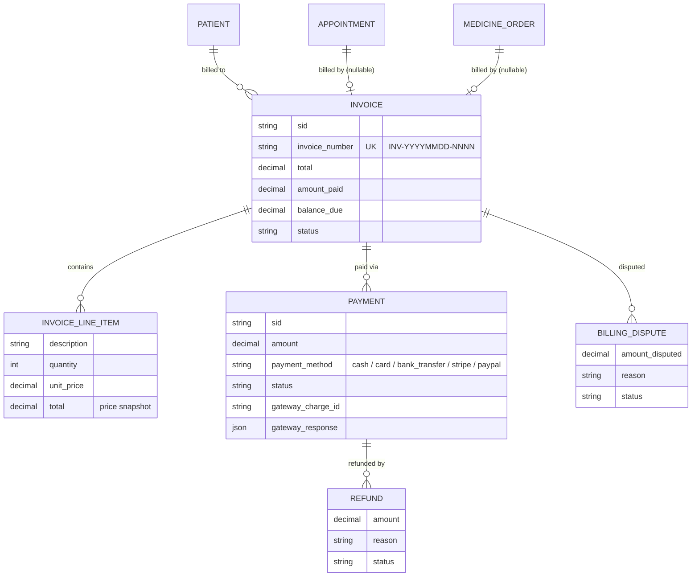
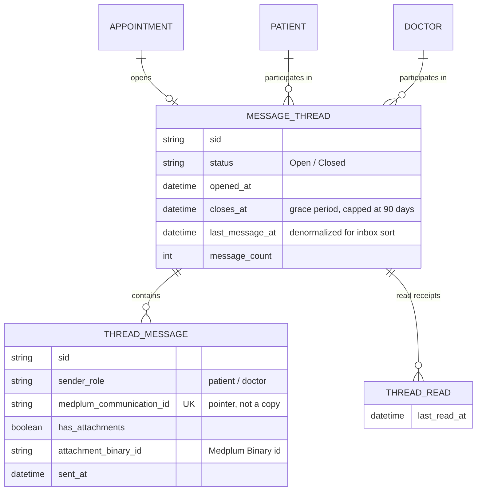

# CHOHEALTH

A full-stack healthcare platform connecting patients and hospitals.

Language: **English** | [Espanol](README.es.md)


---

## Table of contents

1. [Problem statement](#problem-statement)
2. [Architectural decisions](#architectural-decisions)
3. [Business rules](#business-rules)
4. [System architecture](#system-architecture)
5. [Secure messaging (Medplum)](#secure-messaging-medplum)
6. [Real-time delivery tracking](#real-time-delivery-tracking)
7. [Video consultations (Jitsi Meet)](#video-consultations-jitsi-meet)
8. [Database schema](#database-schema)
9. [Capabilities by role](#capabilities-by-role)
10. [Known limitations and simulated behavior](#known-limitations-and-simulated-behavior)
11. [Tech stack](#tech-stack)
12. [Roadmap](#roadmap)
13. [Getting started](#getting-started)
14. [Acknowledgments](#acknowledgments)
15. [Disclaimer](#disclaimer)

---

## Problem statement

Booking a doctor, getting a prescription filled, and paying for care are usually three disconnected experiences for a patient — a phone call to schedule, a paper slip for the pharmacy, a separate portal (or none at all) to see the bill. CHOHEALTH is built to unify that flow into a single product: a patient books an appointment, the doctor produces a medical record and prescription during the visit, the patient fills it through an integrated pharmacy with delivery tracking, and every one of those steps generates a consistent, auditable invoice — all in one authenticated session, in the patient's own language.

The engineering goal behind the project was not to build another CRUD demo, but to practice the parts of healthcare software that are unforgiving of shortcuts: preventing a double-booked doctor, keeping a financial ledger that cannot silently drift from reality, reconciling two different payment gateways against the same billing model, and enforcing who is allowed to see or do what.

This is an active portfolio project, not a finished product — see [Roadmap](#roadmap).

---

## Architectural decisions

| Decision | Rationale |
|---|---|
| Django + DRF for the API | Mature ORM with real database-level constraints (not just serializer validation), and a batteries-included admin (Jazzmin) that covers internal/staff tooling without building a separate admin app. |
| Polymorphic `Invoice` via two nullable one-to-one fields + a `CheckConstraint`, instead of a generic foreign key | Keeps referential integrity and normal SQL joins on `Invoice.appointment` / `Invoice.medicine_order`, while a database-level XOR check makes it structurally impossible to bill both — or neither — target from the same invoice, even if a future view has a bug. |
| Booking conflict prevention enforced at the database layer, not only in view logic | A conditional unique constraint on `(doctor, date)` is the last line of defense against a race condition where two patients pay for the same slot within milliseconds of each other. Application-level checks run first for a fast, friendly error; the constraint is what actually guarantees correctness under concurrency. |
| Hosted checkout (Stripe Checkout, PayPal redirect) as the primary payment path; Stripe Elements only for saved cards | Hosted checkout keeps PCI-DSS scope on the gateway's side instead of the app's. Elements is used narrowly, for the one flow (saving a card for later) where a hosted redirect would be worse UX. |
| One shared Stripe webhook for both appointments and pharmacy orders, routed by metadata | Avoids duplicating webhook signature verification and event handling for two billable entity types; the invoice/payment model already treats them polymorphically, so the webhook mirrors that. |
| Role stored on the user (`user_type`) but never trusted alone for authorization | Custom DRF permissions (`IsDoctor`, `IsPatient`) check the role **and** that the related profile object actually exists. A user who claims a role without a matching profile is not authorized — closing a gap that a naive `request.user.user_type == 'Doctor'` check would leave open. |
| Denormalized doctor rating, kept in sync via signals | The doctor list/search is a hot read path; recomputing an average on every request does not scale as reviews grow. A `post_save`/`post_delete` signal on `Review` recalculates and persists the aggregate instead. |
| `DATABASE_URL`-driven database selection (PostgreSQL in production via `dj-database-url`, SQLite fallback locally) | Zero-configuration local development with no external dependency, production-grade database in deployment without touching code. |
| MinIO (S3-compatible object storage) as the media backend | Self-hosted, API-compatible with the same `django-storages` S3 backend production code would use against real AWS S3 — file storage that behaves identically in local development and production without a dependency on a third-party SaaS quota. |
| Postal (self-hosted mailer) for transactional email over SMTP | Owns the full delivery pipeline (SPF/DKIM, bounce handling, a real MTA) without depending on a third-party API's free-tier limits, on the same self-hosted infrastructure as the rest of the platform. |
| Medplum (self-hosted, FHIR-native) for secure patient-doctor messaging, with Postgres holding only metadata | Message content and attachments are PHI and belong in a system built around FHIR's encryption, access-control and interoperability standards, not bolted onto the app's own database. Postgres (`MessageThread`/`ThreadMessage`) never stores a message body or file — only participants, timestamps and read state — so the inbox can list and sort without a Medplum round trip, and a Medplum outage never risks the app's own data. See [Secure messaging](#secure-messaging-medplum). |
| Self-hosted Jitsi Meet (JWT-secured) for virtual appointment video calls, with the room name derived instead of stored | No third-party video SaaS, no per-minute billing, and nothing that grants room access lives in the database — the room name is recomputed server-side from the appointment's `sid` and a secret salt on every request, so knowing the (already-public) `sid` alone is not enough to join. See [Video consultations](#video-consultations-jitsi-meet). |
| Native `fetch` wrapper (`src/lib/api.ts`) instead of a heavier HTTP client on the frontend | One place to attach the JWT bearer token, the `Accept-Language` header, and multipart handling — no extra runtime dependency for what is a thin, predictable API layer. |
| Next.js App Router with role-scoped route trees (`/dashboard/doctor`, `/dashboard/patient`, `/dashboard/delivery`, `/dashboard/admin`) | File-system routing maps directly onto each very different user journey, and each dashboard tree ships only the components its role needs. |
| A separate Expo (React Native) app for the courier role, instead of a browser tab | Background GPS tracking with the app backgrounded or the phone locked is unreliable-to-impossible from a browser's Geolocation API, but is a first-class native capability (`expo-location` background tasks). The courier's web dashboard is intentionally read-only (history, stats, profile) — every action that depends on live location happens only in the native app. See [Real-time delivery tracking](#real-time-delivery-tracking). |
| Delivery assignment and offer expiry driven entirely by real events (a payment succeeding, a courier declining, a delivery completing), not a scheduled worker | Consistent with the rest of the codebase (see [Secure messaging](#secure-messaging-medplum)'s circuit breaker and the billing webhook) — this project deliberately has no Celery/cron anywhere. An expired offer is detected lazily, the next time anything reads or acts on it, rather than by a background task racing the clock. |
| A patient-confirmed map pin (search + drag, like a food-delivery app's address picker) instead of geocoding free-text address input after the fact | Free-text geocoding against a service like Nominatim can silently resolve to the wrong precision — a whole neighbourhood instead of a building — with no visible signal that it happened. Capturing the coordinate the patient actually confirmed on a map is strictly more reliable than trying to recover it from text later, and is what the geofence and the courier's live map are built on. |

---

## Business rules

The rules below are enforced in code (model constraints, `clean()` validators, or permission classes), not just described in documentation — each one maps to a specific safeguard in the codebase.

**Scheduling**
- An appointment's clinical status (`Unpaid`, `Confirmed`, `In Progress`, `Completed`, `Cancelled`, `No Show`) is tracked independently from its payment status, which lives on the linked `Invoice`.
- A doctor cannot hold two appointments in a blocking status (`Confirmed`, `In Progress`, `Completed`, `No Show`) at the same date and time — enforced by a conditional unique constraint at the database level, so `Unpaid` and `Cancelled` slots are free to coexist or be retried.
- Virtual appointments cannot have a branch assigned; in-person appointments must have one.
- Cancellations record who cancelled (patient, doctor, admin, or system) and why; reschedules preserve the original datetime and increment a counter.
- A patient cancelling a paid appointment gets a refund percentage set by how much notice they gave: 100% more than 48 hours out, 50% between 24 and 48 hours, 0% inside 24 hours. A doctor-initiated cancellation always refunds 100%, regardless of notice — the patient is never penalized for a doctor's decision.
- A doctor's weekly availability (`DoctorSchedule`) has no self-service API — schedule blocks are created and edited exclusively through the Django admin. A doctor can read their own schedule but not change it from their dashboard (see [Known limitations](#known-limitations-and-simulated-behavior)).

**Clinical records and consultation workflow**
- A medical record is created at most once per appointment and is the anchor for any prescription or lab order tied to that visit.
- A prescription line can point to a catalog medication or be free text — a doctor is not blocked from prescribing something outside the hospital's own formulary.
- A doctor can only move an appointment along a fixed status graph: `Confirmed` → `In Progress`, `Completed`, `Cancelled` or `No Show`; `In Progress` → `Completed` or `Cancelled`. Any other transition is rejected.
- A virtual appointment's meeting link and Jitsi room are generated automatically the moment payment confirms it — never something a doctor supplies by hand — and a join token is minted per participant, per request, only within a time window around the scheduled visit (see [Video consultations](#video-consultations-jitsi-meet)).
- Closing a consultation is a single atomic action: it creates the medical record and, in the same request, an optional prescription and/or lab order together. It cannot be run twice on the same appointment, and none of those three records can be edited or deleted afterward through the API — from the API's perspective, a patient's clinical history is append-only.

**Pharmacy and prescription fulfillment**
- Medications and lab tests each declare, independently, two flags: `requires_prescription` and `free_when_prescribed`. If `requires_prescription` is `False`, a patient can buy or book the item directly, with no doctor involved. If it's `True`, the purchase or booking endpoint requires an unclaimed prescription item for that exact medication or lab test — issued earlier by a doctor through a completed appointment (`MedicalRecord` → `Prescription`/`LabOrder`) — and returns `403` otherwise. There is no way to acquire a prescription-gated item without that prior visit.
- Pricing for a prescription-gated item is `$0` only when it is backed by an unclaimed prescription item **and** the catalog entry has `free_when_prescribed = True` (the default); otherwise the patient pays the full catalog price, whether or not a prescription exists.
- A prescribed medication (or lab test) can be claimed at most once across all non-cancelled orders — enforced with a one-to-one link between the order line and the source prescription item, so the same prescription can't be dispensed twice through parallel pickup/delivery paths.
- Shipping is priced differently depending on which of two distinct pharmacy flows the order goes through, and the two are not interchangeable:
  - **Pharmacy cart** (buying medications, prescribed or not, one at a time): shipping is always free regardless of pickup or delivery — the per-item price already accounts for it. Claiming a `$0` prescribed item through the cart with delivery selected costs nothing at all, shipping included.
  - **Dedicated "request delivery" flow** (bundles every unclaimed prescribed medication from one prescription into a single delivery order): always charges a flat shipping fee on top, regardless of whether the bundled medications price at `$0` or at full cost. This is the only path in the system where shipping is charged.
- A pharmacy order's pickup code is generated once, only at the moment it becomes `Paid` (online payment or fully covered by a prescription); it stays unset while payment is pending, so an unpaid order can never be collected at a branch.

**Delivery**
- A courier's shift status (`off_duty` / `on_duty` / `on_break`) gates whether the assignment algorithm considers them a candidate at all — an off-duty or on-break courier is never offered a delivery.
- A courier cannot start a break, or clock out, while a delivery is actively assigned to them (any stage before `delivered`). One delivery at a time, start to finish, before the next shift-state change is allowed.
- A delivery offer expires 45 seconds after it's made if the courier doesn't respond; a decline or an expiry both cascade to the next-closest available courier, never back to someone who already saw that same delivery.
- The "arrived" geofence check blocks confirmation outright when the courier's GPS is clearly outside `MAX_GEOFENCE_METERS` (150m) of the confirmed delivery point — the response includes the actual distance so the courier knows how far off they are. It only skips the check (never blocks) when there's no destination coordinate to compare against at all, rather than stranding the delivery on a technicality.
- Proof of delivery requires both a photo and the courier's GPS position at that exact moment — neither alone is accepted.

**Reviews**
- A review can only be submitted for an appointment with status `Completed`, and only by the patient who owns that appointment; that same patient can later edit or delete it, and only one review exists per appointment.
- Review visibility is public, not limited to the author: any patient can browse a feed of every review across every doctor, and a specific doctor's individual reviews are readable even by an unauthenticated visitor. The doctor catalog a patient browses before booking already surfaces each doctor's aggregate rating and review count — a patient is expected to shop by reputation before ever being seen by that doctor, not just rate one afterward.

**Billing**
- Every invoice bills exactly one of an appointment or a pharmacy order — never both, never neither — enforced with a database check constraint.
- Invoice numbers are sequential per calendar day (`INV-YYYYMMDD-NNNN`).
- Line items store a price snapshot at billing time; later price changes to the underlying service or medication never alter historical invoices.
- The sum of completed refunds against a payment can never exceed the original payment amount.
- Every payment retains the gateway's raw response alongside a normalized status, so reconciliation never requires going back to Stripe or PayPal support.

**Identity and access**
- Authentication is by email, not username; usernames are derived automatically and de-duplicated with a numeric suffix.
- A user's role (`Patient` / `Doctor` / `Delivery` / `Superuser`) is necessary but not sufficient for authorization — access also requires the matching profile object to exist (a `Superuser` is the one exception, gated on Django's own `is_superuser` flag instead of a profile).
- Access tokens expire after 30 minutes; refresh tokens after 7 days, with rotation enabled so a captured refresh token can be used only once before it is invalidated.

**Secure messaging**
- A thread opens automatically the moment an appointment's payment succeeds (i.e. it becomes `Confirmed`) — never at booking, and never at signup — with one exception: a lab-only visit or a non-`Consultation` service never gets a thread, since there is no doctor conversation to have.
- Completing a consultation grants a grace period instead of closing the thread outright: 14 days by default, extended to 30 days if the visit left a pending lab order (not yet `Completed`/`Cancelled`) or any prescription to follow up on — capped at 90 days from when the thread first opened, so a lab result that never comes back doesn't keep the channel open indefinitely.
- Cancelling the appointment, by either party, closes its thread immediately — no grace period for a visit that never happened.
- A doctor can also end the conversation manually at any time via a dedicated "End conversation" action, independent of the appointment's own lifecycle.
- Message content and attachments live in Medplum, never in CHOHEALTH's own database — `ThreadMessage` stores only who sent it, when, and a pointer to fetch the content; the thread list endpoint deliberately excludes any message preview, for the same reason.
- If Medplum is unreachable, a circuit breaker trips after 3 consecutive failures and messaging endpoints answer `503` for 60 seconds; every other feature (booking, payments, prescriptions) is unaffected.

---

## System architecture



Each Django app owns its own models and views but shares one PostgreSQL/SQLite database; there is no service boundary between them at the data layer, by design — this is a modular monolith, not a microservice system, which matches the project's actual scale and avoids paying a distributed-systems tax it does not need. Medplum is the one deliberate exception: it is a separate, self-hosted FHIR server, not another table in the same database, because message content and attachments are PHI that belongs behind FHIR's own standards rather than inside the monolith's schema.

---

## Secure messaging (Medplum)

CHOHEALTH previously had no channel for a patient and doctor to communicate outside a scheduled visit — the only thing close to it was a one-way, threadless `Notification`. Secure messaging closes that gap using [Medplum](https://github.com/medplum/medplum), a self-hosted, open-source, FHIR-native platform, instead of building bespoke chat infrastructure that would need to reinvent encryption, access control and interoperability from scratch.

**Hybrid storage, by design.** Postgres and Medplum each own a different half of the problem, and neither is a cache of the other:
- **Postgres** (`MessageThread`, `ThreadMessage`, `ThreadRead`) holds only workflow metadata — who's in the thread, when it opened/closes, unread counts, timestamps. This is what lets the inbox list, sort and paginate without a network call to Medplum on every page load.
- **Medplum** holds everything that is actually PHI — the message text and any attachment — as FHIR `Communication` and `Binary` resources. `ThreadMessage.medplum_communication_id` is a pointer, not a cache; the content is fetched from Medplum on demand, and the inbox listing endpoint deliberately never includes a message preview.

**Lifecycle tied to clinical need, not a fixed calendar.** A thread's write window is not "N days after checkout" — it tracks whether there's still a plausible reason to keep talking (see [Business rules](#business-rules) for the exact grace-period rules), and a doctor can also close a conversation manually at any time.

**Attachments never expose Medplum directly.** A file is uploaded to a Medplum `Binary` resource and referenced from the `Communication` payload; downloads are proxied through Django (`ThreadAttachmentDownloadView`), which fetches the bytes server-side, so a client never receives — or needs — a direct, potentially long-lived Medplum URL.

**Graceful degradation.** `MEDPLUM_ENABLED=False` (the default) turns the feature off cleanly with no impact on the rest of the app; with it enabled, a circuit breaker isolates a Medplum outage to just the messaging endpoints (see [Business rules](#business-rules)).

---

## Real-time delivery tracking

Pharmacy delivery used to be simulated — `MedicineDelivery.stage` advanced through 5 fixed stages on a timer, computed from elapsed time on every poll, with no courier, no GPS, and no real-world event driving it. It's now a real tracked delivery, end to end: a third user role (`Delivery`), a proximity-based assignment algorithm, a companion native app for the courier, and a live map for the patient.

**Why a native app instead of another web dashboard.** The one hard requirement — a courier's position updating while the app is backgrounded or the phone is locked — is not something a browser tab can do reliably. `expo-location`'s background task API can. The courier's web dashboard (`/dashboard/delivery`) still exists, but deliberately does nothing that depends on live location: it's read-only history, stats and profile. Every action that needs GPS — clocking in, receiving an offer, marking a delivery in transit or arrived — happens in the Expo app.

**Assignment: proximity-ranked, one offer at a time, no scheduled worker.**
1. The instant a delivery-method order is paid, `try_assign()` runs (via `transaction.on_commit`, so it only fires once the payment is actually committed) and ranks every on-duty, idle courier by haversine distance to the pickup branch.
2. The closest candidate gets a `DeliveryOffer` with a 45-second window and, when EAS push is configured, a push notification; until then (or as a resilience fallback), the courier's app polls for a pending offer every 5 seconds.
3. A decline, or the 45 seconds elapsing, cascades to the next-closest courier who hasn't already seen this exact delivery — never back to someone who already declined or timed out on it.
4. If nobody is free, the delivery just sits unassigned; the same `try_assign()` reruns automatically the next time any courier frees up (finishes a delivery) or an offer is declined/expires. There is no Celery/cron anywhere in this flow, matching the rest of the codebase (see [Business rules](#business-rules)) — every trigger is a real event, and a stale offer is treated as expired lazily, the next time it's read or acted on.

**The address picker replaces blind geocoding.** The original plan geocoded the patient's free-text delivery address after the fact (via Nominatim). In practice this failed silently in exactly the way you'd expect: a specific street address it couldn't resolve precisely fell back to matching the entire surrounding neighbourhood — a coordinate that *looked* precise but was off by close to a kilometer, discovered by literally standing at the resolved point and watching the geofence report "you're far away." The fix was to stop guessing after the fact: the patient now confirms an exact point on a map (search-as-you-type via Nominatim, or drag/tap a pin directly — the same pattern as a food-delivery app's checkout) at order time, and that confirmed coordinate is what the courier's live map and the "arrived" geofence check both use. The backend still geocodes as a fallback for any order that somehow skips the picker, but now discards a match that isn't at least street-level precision (`place_rank`) instead of accepting a neighbourhood-wide guess.

**What the courier app does** (`mobile/`, Expo Router + TypeScript):
- Clock in/out and breaks, blocked while a delivery is actively assigned (see [Business rules](#business-rules)).
- Background GPS ping every ~12 seconds while on duty, independent of whether a delivery is active — proximity ranking needs a position even for an idle courier.
- Accept/decline an offer with a live countdown.
- Two stage actions: "Start Transit" (this is the moment the patient's map goes live) and "Mark Arrived" (requires a photo of the delivered package plus the courier's GPS position at that instant — both together are the proof of delivery, neither alone).
- A soft, non-blocking geofence warning if the courier's position doesn't match the confirmed delivery point closely enough — still completes the delivery either way, since a GPS fix can legitimately be off.

**What the patient sees.** The tracking page stays a plain-text stepper (`picked_up` → `on_the_way` → `delivered`) until the courier starts transit — no map, nothing to show yet. Once they're on the way, a live map (`react-leaflet` + OpenStreetMap tiles, no API key) appears with the courier's position and the confirmed delivery pin; if the courier's last ping goes stale (>60s), the UI says so explicitly ("last known location N minutes ago") instead of silently freezing the pin in place.

**What's still a known gap, not a limitation of the design:** the Expo app hasn't been linked to an EAS project yet, so push notifications aren't live in production — the 5-second poll on the courier's home screen is the fallback and makes the app fully usable without push, just not instant. Setting up `eas build`/`eas submit` for a real installable app (instead of Expo Go) is the natural next step.

---

## Video consultations (Jitsi Meet)

A virtual appointment used to be virtual in name only: `Appointment.meeting_link` existed as a field from day one, but nothing ever set it — a doctor had to go create a room in an outside tool and paste the URL in by hand before the call could start, with no verification that the link even worked. It's now a real, self-hosted video call: [Jitsi Meet](https://github.com/jitsi/docker-jitsi-meet), deployed on the same VPS as the rest of the platform, with the room generated and secured automatically.

**The link is generated the moment payment confirms the appointment, not when the call starts.** `ensure_meeting_link()` runs inside the same atomic transaction that flips a paid appointment to `Confirmed` (`billing/payment_views.py`) — no dependency on the doctor remembering to do anything, and no network dependency on Jitsi itself being reachable at that instant, since generating the link is pure local computation (see the next point). Both patient and doctor see a "Join consultation" button on the appointment as soon as it's paid, well before the visit starts.

**The stored link is a CHOHEALTH URL, not a Jitsi URL — deliberately.** Jitsi is configured with JWT authentication (`ENABLE_AUTH=1`, `AUTH_TYPE=jwt`, guests disabled), so nobody can join a room without a valid signed token, even with the URL in hand — which means a plain link straight to Jitsi would stop working the moment auth is on: it always needs a fresh, per-user, signed token appended, and a token is a bad thing to persist in a database column, since it expires and is bound to one identity. So `meeting_link` actually points at `/join/<sid>` on the CHOHEALTH frontend; that page authenticates the visitor, confirms they're the patient or the doctor on that specific appointment, and only then calls `GET /appointments/<sid>/meeting-token/` to mint a short-lived (2-hour) token and redirect straight into the room.

**Room names are derived, never stored.** The Jitsi room itself is `cho-<hmac-sha256(appointment.sid)[:32]>`, computed on demand from a server-side salt rather than persisted anywhere — so the appointment's public `sid`, which already appears in URLs and API payloads, is never reused as something that grants access on its own. Knowing the sid gets you nowhere without also holding a valid, freshly-signed token.

**Who can join, and when.** The token endpoint checks three things before it signs anything: the requester is the patient or the doctor on that exact appointment (`403` otherwise), the appointment is `Confirmed` or `In Progress` (not `Cancelled`, `Completed`, or still `Unpaid`), and the current time falls inside a window around the scheduled slot — 15 minutes before, through the service's duration, plus a 60-minute grace period after. Outside that window the endpoint returns `403` with an `available_from` timestamp instead of a token, and the join page surfaces that instead of a dead button. The doctor is always signed into the room as a Jitsi moderator; the patient never is.

**What's still a known gap:** the appointment-confirmation email doesn't carry the meeting link yet — only the "virtual visit started" email does, fired when the doctor flips the appointment to `In Progress` (see the notification table in [Capabilities by role](#capabilities-by-role)). The link is already visible in-app well before that email would fire, so this is a smaller gap than it sounds, but a natural next step.

---

## Database schema

The schema is split across four diagrams that mirror the Django apps, to keep each one legible. Primary keys are UUID-like short IDs (`sid`) exposed to the API; numeric IDs stay internal.

### Identity and care team



### Scheduling and clinical records



### Pharmacy and delivery



### Billing



`Invoice.appointment` and `Invoice.medicine_order` are both nullable one-to-one fields; a database `CheckConstraint` requires exactly one of them to be set, which an entity-relationship diagram cannot express directly — it is enforced in `billing/models.py`, not only in application code.

### Secure messaging



Note what is absent: no message body, no file, no `THREAD_MESSAGE` field holding anything a patient or doctor actually wrote. That content exists only as FHIR resources in Medplum — this table intentionally cannot leak PHI even if the whole Postgres database were dumped.

---

## Capabilities by role

### Patient

- **Account**: register, log in, edit profile (contact info, demographics, photo), personal stats dashboard (appointments, records, lab results, unread notifications).
- **Appointments**: browse the public service/doctor catalog (visible even logged out), book in-person or virtual, pay immediately or later, list own appointments, reschedule for free against the doctor's live schedule, cancel with a time-based refund, or delete outright while still unpaid.
- **Clinical history**: read-only access to own medical records, prescriptions, and lab orders/results; download prescription and lab-order PDFs on demand.
- **Pharmacy**: browse the over-the-counter medication catalog (public), buy medications — over-the-counter or prescribed — through a cart supporting pickup or delivery, or bundle every pending prescribed medication into one dedicated delivery request.
- **Lab tests**: browse the public lab catalog (flagged with a "free for you" badge when an unclaimed matching prescription exists), book a lab directly when it doesn't require a prescription, or for free against one that does.
- **Delivery tracking**: list every delivery-mode order and poll a live per-order tracker — a plain-text stepper until the courier starts transit, then a live map with the courier's position and the confirmed delivery pin (see [Real-time delivery tracking](#real-time-delivery-tracking)).
- **Payments**: Stripe/PayPal checkout, manage saved cards, personal payment history and totals.
- **Reviews**: rate and comment on any doctor from a completed appointment (one per appointment, editable), and separately browse a public feed of every review across every doctor, or one doctor's reviews specifically — not limited to the patient's own submissions.
- **Secure messaging**: message the doctor from a confirmed (or recently completed) appointment's thread, see unread counts, and send image/PDF attachments — see [Secure messaging](#secure-messaging-medplum).
- **Notifications**: list, filter by read/unread, mark as read, delete.

### Doctor

- **Profile**: edit own profile and bio; add or remove qualifications (degree, institution, year, certificate).
- **Availability**: read own weekly schedule via the API. Schedule blocks themselves are currently managed only through the Django admin, not self-service (see [Known limitations](#known-limitations-and-simulated-behavior)).
- **Agenda**: list and filter own appointments by date/month; view full appointment detail, including the patient's contact and demographic info.
- **Consultation workflow**: drive an appointment through `Confirmed → In Progress → Completed` (or `Cancelled`/`No Show`); close a consultation in one atomic action that creates the medical record and, optionally, a prescription and/or lab order together (see [Business rules](#business-rules)).
- **Cancel/reschedule**: cancel a confirmed appointment (always a full refund to the patient) or reschedule it against their own live schedule.
- **Payments and stats**: own received payments and revenue stats; a dashboard summarizing appointment counts, patient counts, average rating, review count, revenue, and unread notifications.
- **Reviews**: read own reviews via the public per-doctor endpoint; cannot respond to, edit, or delete a patient's review.
- **Secure messaging**: same thread view from the doctor's side, plus the ability to end a conversation manually before its grace period would otherwise expire.
- **Notifications**: list, filter, mark as read, delete.

### Delivery (courier)

- **Account**: register, log in — the Expo app only (the web login rejects a non-courier account and vice versa; see [Real-time delivery tracking](#real-time-delivery-tracking)).
- **Shift**: clock in/out, start/end a break — blocked while a delivery is actively assigned (see [Business rules](#business-rules)).
- **Offers**: receive a delivery offer (push, or the app's own poll), accept or decline against a live countdown.
- **Active delivery**: mark a picked-up delivery "in transit" (this is what makes the patient's map go live), then "arrived" with a proof photo and GPS position.
- **Web dashboard** (`/dashboard/delivery`, read-only): shift stats (today's/completed deliveries, average time), delivery history, profile — no action here depends on live location, by design.

### Superuser (Admin)

- **Web dashboard** (`/dashboard/admin`, read-only for now): every user across every role with their basic profile info, every delivery platform-wide, and a per-user delivery history (as the patient who received them, or the courier who ran them).
- Everything else — creating doctors/patients, editing catalogs, assigning schedules — still goes through the Django admin (Jazzmin); extending the frontend dashboard to cover that is on the [Roadmap](#roadmap).

### Email notifications (Postal, self-hosted SMTP)

Every transactional email is fire-and-forget — a failed send is logged, never blocks the request — and shares one branded template. Eight distinct triggers exist end to end:

| Trigger | Fired when | Attachment |
|---|---|---|
| Password reset | A reset is requested | — |
| Appointment confirmed | Payment for an appointment succeeds | Invoice PDF |
| Appointment cancelled | Either party cancels | — |
| Appointment rescheduled | Either party reschedules | — |
| Virtual visit started | Doctor marks a virtual appointment `In Progress` | Meeting link |
| Pharmacy order ready for pickup | A pickup-method order is paid | QR pickup code, invoice PDF |
| Pharmacy order shipped | A delivery-method order is paid | Invoice PDF, tracking link |
| Delivery completed | The courier marks a delivery "arrived" | — |

There is currently no welcome email on signup and no "lab results ready" email — both are natural additions, not yet built.

---

## Known limitations and simulated behavior

Being upfront about what's a deliberate demo-scope simplification versus a real integration:

- **Doctor availability has no self-service API yet.** A doctor's weekly schedule (`DoctorSchedule`) can currently only be created or edited through the Django admin — there is no "manage my availability" endpoint on the doctor's own dashboard.
- **Secure messaging requires a running Medplum instance to actually send messages.** `MEDPLUM_ENABLED=False` (the default) disables the feature cleanly — booking, payments, and clinical records behave identically either way — but with it enabled, a Medplum outage does surface as a `503` on the messaging endpoints specifically (see [Secure messaging](#secure-messaging-medplum)).
- **The courier app isn't linked to an EAS project yet**, so push notifications for delivery offers aren't live — the app's own 5-second poll is the fallback path and keeps it fully usable in the meantime (see [Real-time delivery tracking](#real-time-delivery-tracking)).
- **The admin dashboard is read-only.** Creating doctors/patients, editing the catalog, and assigning schedules still requires the Django admin (Jazzmin) — the frontend dashboard currently only lists users and deliveries.

---

## Tech stack

| Layer | Technology |
|---|---|
| Backend | Django 6, Django REST Framework, `djangorestframework-simplejwt` |
| Database | PostgreSQL (production, via `dj-database-url`), SQLite (local fallback) |
| Media storage | MinIO (S3-compatible, self-hosted) |
| Secure messaging | Medplum (self-hosted, FHIR-native) |
| Static files | Whitenoise |
| Admin UI | Django Jazzmin |
| Payments | Stripe (Checkout, Setup Intents, webhooks), PayPal (Orders API) |
| Email | Postal (self-hosted SMTP) |
| Frontend | Next.js 16 (App Router), React 19, TypeScript |
| UI | shadcn/ui, `@base-ui/react`, Tailwind CSS v4, Framer Motion |
| i18n | `next-intl` (English/Spanish) |
| Mobile (courier app) | Expo (Expo Router), React Native, TypeScript |
| Live map | `react-leaflet` + OpenStreetMap tiles (no API key) |
| Geocoding / address search | Nominatim (OpenStreetMap, no API key) |

---

## Roadmap

- **Structured FHIR resource sync**, extending the Medplum integration beyond messaging — mirroring appointments, prescriptions and lab orders as FHIR resources (`Encounter`, `MedicationRequest`, `ServiceRequest`) via a write-through outbox, with Postgres remaining the source of truth throughout.
- A doctor-facing schedule management endpoint, so weekly availability no longer requires the Django admin.
- **EAS build/submit for the courier app**, so it's a real installable app with working push notifications instead of running through Expo Go with a polling fallback (see [Real-time delivery tracking](#real-time-delivery-tracking)).
- **Full CRUD from the admin dashboard** — creating doctors and patients, editing the catalog, assigning schedules — currently still Django-admin-only (see [Capabilities by role](#capabilities-by-role)).
- A doctor payment/payout model — how doctors themselves get paid for completed appointments — designed but not yet built.

---

## Getting started

### Prerequisites

- Python 3.13+ (the bundled `venv` uses 3.14)
- Node.js 18.18+ (20+ recommended for Next.js 16)
- API keys for Stripe and PayPal
- An S3-compatible object store for media (MinIO or AWS S3)
- An SMTP server for transactional email (self-hosted [Postal](https://github.com/postalserver/postal) in production; any SMTP server works locally)
- A [Medplum](https://github.com/medplum/medplum) instance for secure messaging — optional locally, the feature degrades cleanly when `MEDPLUM_ENABLED=False` (see [Known limitations](#known-limitations-and-simulated-behavior))
- A self-hosted [Jitsi Meet](https://github.com/jitsi/docker-jitsi-meet) instance with JWT auth configured, for video consultations — `JITSI_APP_SECRET` just needs to match what your Jitsi deployment is configured with (see [Video consultations](#video-consultations-jitsi-meet))
- PostgreSQL (optional locally — falls back to SQLite if `DATABASE_URL` is unset)

### Backend

```powershell
cd backend\CHOHEALT_BACK

python -m venv venv
.\venv\Scripts\Activate.ps1

pip install -r requirements.txt

# create backend\CHOHEALT_BACK\.env — see variables below

python manage.py migrate
python manage.py createsuperuser   # optional, for /admin
python manage.py runserver
```

API available at `http://127.0.0.1:8000/api/`, admin at `http://127.0.0.1:8000/admin/`.

`backend/CHOHEALT_BACK/.env`:

```
SECRET_KEY=
DEBUG=True
ALLOWED_HOSTS=
CORS_ALLOWED_ORIGINS=http://localhost:3000
FRONTEND_URL=http://localhost:3000

DATABASE_URL=                 # optional; falls back to local SQLite
DATABASE_NAME=
DATABASE_USER=
DATABASE_PASSWORD=
DATABASE_HOST=
DATABASE_PORT=

AWS_ACCESS_KEY_ID=
AWS_SECRET_ACCESS_KEY=
AWS_STORAGE_BUCKET_NAME=
AWS_S3_ENDPOINT_URL=           # e.g. https://minio.example.com
AWS_S3_REGION_NAME=us-east-1

STRIPE_SECRET_KEY=
STRIPE_WEBHOOK_SECRET=

PAYPAL_CLIENT_ID=
PAYPAL_CLIENT_SECRET=
PAYPAL_MODE=sandbox            # or "live"

EMAIL_HOST=
EMAIL_PORT=25
EMAIL_USE_TLS=False
EMAIL_HOST_USER=
EMAIL_HOST_PASSWORD=
DEFAULT_FROM_EMAIL=

MEDPLUM_ENABLED=False           # set True once a Medplum instance is reachable
MEDPLUM_BASE_URL=
MEDPLUM_CLIENT_ID=
MEDPLUM_CLIENT_SECRET=

JITSI_BASE_URL=                 # e.g. https://meet.example.com
JITSI_APP_ID=
JITSI_APP_SECRET=               # must match your Jitsi deployment's JWT_APP_SECRET
JITSI_JWT_AUDIENCE=jitsi
JITSI_JWT_SUB=                  # your Jitsi domain
JITSI_JWT_TTL_MINUTES=120
```

### Frontend

```powershell
cd frontend
npm install
```

`frontend/.env`:

```
NEXT_PUBLIC_API_URL=http://localhost:8000/api
NEXT_PUBLIC_STRIPE_PUBLISHABLE_KEY=
NEXT_PUBLIC_PAYPAL_CLIENT_ID=
```

```powershell
npm run dev
```

Frontend available at `http://localhost:3000`. Run backend and frontend in two terminals — the frontend depends on the API for everything (authentication, appointments, payments, and so on).

### Mobile (courier app)

Only needed to run the delivery role's native side — the web app runs fully without this.

```powershell
cd mobile
npm install
```

`mobile/.env`:

```
EXPO_PUBLIC_API_URL=http://localhost:8000/api
```

```powershell
npx expo start
```

Open in [Expo Go](https://expo.dev/go) on a physical device — background location and camera don't work reliably in a simulator/emulator, and push notifications need an EAS project (not yet configured; the app's own polling fallback keeps it usable regardless — see [Real-time delivery tracking](#real-time-delivery-tracking)).

---

## Acknowledgments

Secure patient-doctor messaging in CHOHEALTH is built on [Medplum](https://www.medplum.com/) ([github.com/medplum/medplum](https://github.com/medplum/medplum)), an open-source, FHIR-native healthcare platform, self-hosted for this project. Medplum's `Communication` and `Binary` FHIR resources do the actual work of standards-compliant storage for message content and attachments — exactly the property this integration needed, and not something worth reinventing from scratch. Credit to the Medplum team and its open-source community for building and maintaining it.

The rest of this project's self-hosted infrastructure also leans on open source: [MinIO](https://min.io/) for S3-compatible media storage and [Postal](https://github.com/postalserver/postal) for transactional email — chosen for the same reason as Medplum, mature building blocks over bespoke ones.

Delivery tracking's live map and address search run entirely on the [OpenStreetMap](https://www.openstreetmap.org/copyright) project — map tiles and geocoding via its [Nominatim](https://nominatim.org/) service, rendered with [Leaflet](https://leafletjs.com/)/[react-leaflet](https://react-leaflet.js.org/) — free, no API key, maintained by its community of volunteer contributors. The courier's native app is built on [Expo](https://expo.dev/), whose managed React Native tooling (`expo-location`'s background task API in particular) is what makes real background GPS tracking practical without hand-rolling native modules for iOS and Android separately.

---

## Disclaimer

This is a portfolio and learning project demonstrating full-stack engineering and healthcare-domain business logic. It is not certified medical software and is not intended to handle real patient data in production without further compliance work.
