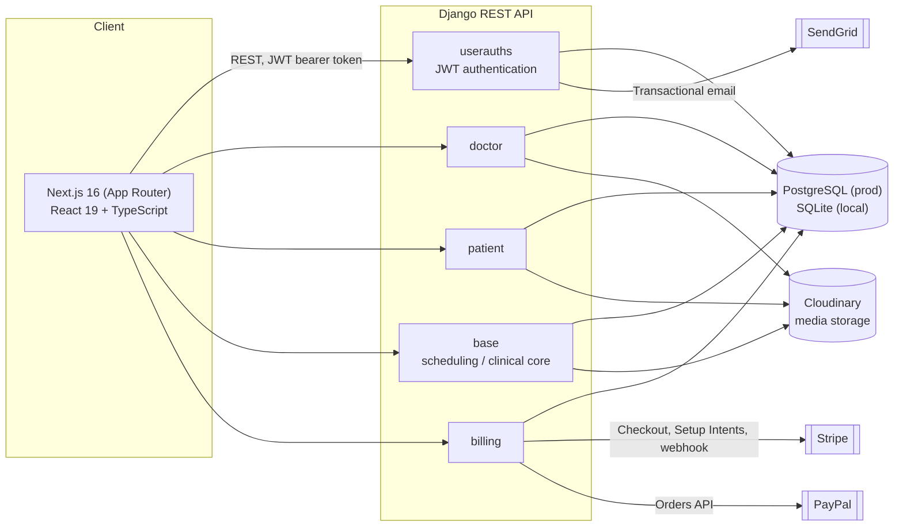
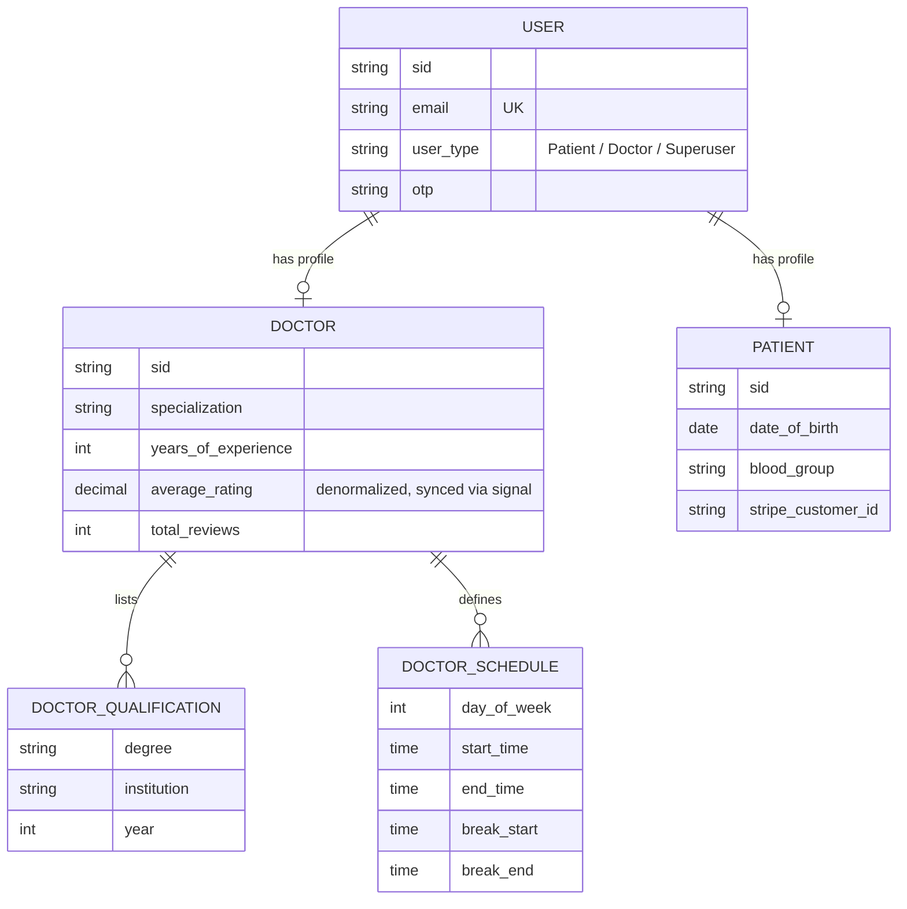
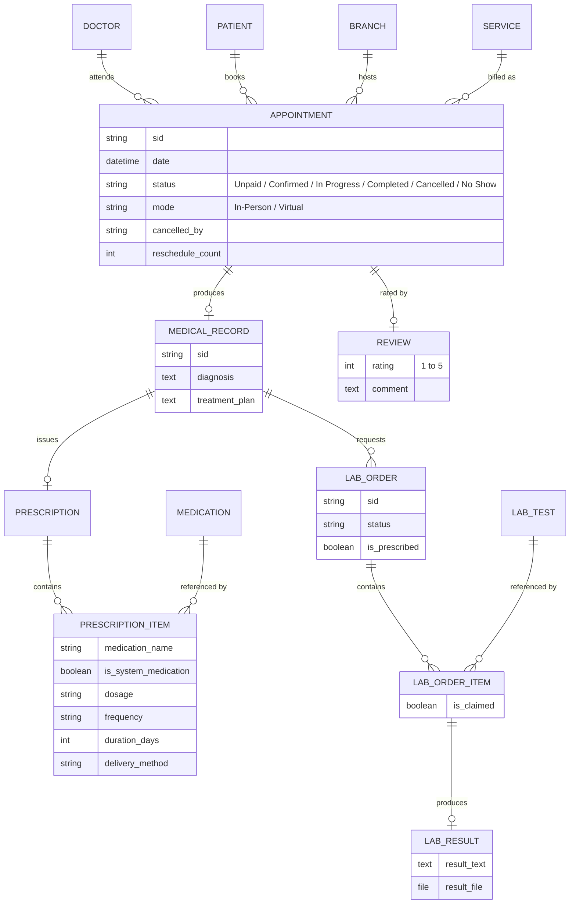
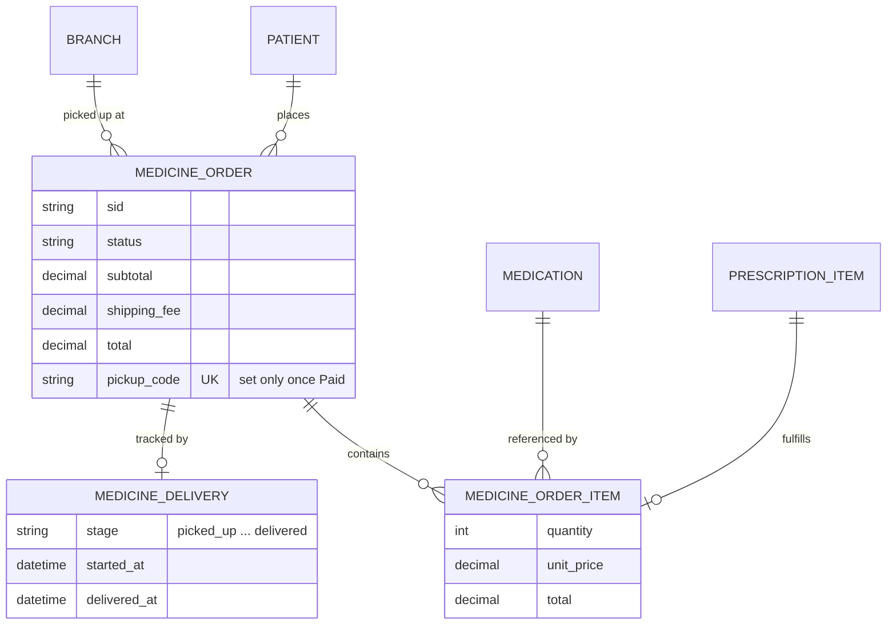
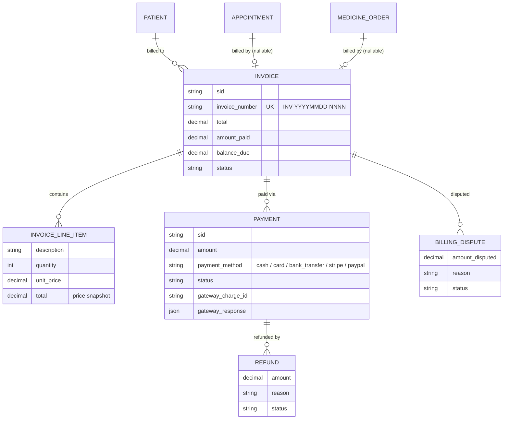

# CHOHEALTH

A full-stack healthcare platform connecting patients and hospitals.

Language: **English** | [Espanol](README.es.md)


---

## Table of contents

1. [Problem statement](#problem-statement)
2. [Architectural decisions](#architectural-decisions)
3. [Business rules](#business-rules)
4. [System architecture](#system-architecture)
5. [Database schema](#database-schema)
6. [Capabilities by role](#capabilities-by-role)
7. [Known limitations and simulated behavior](#known-limitations-and-simulated-behavior)
8. [Tech stack](#tech-stack)
9. [Roadmap](#roadmap)
10. [Getting started](#getting-started)
11. [Disclaimer](#disclaimer)

---

## Problem statement

Booking a doctor, getting a prescription filled, and paying for care are usually three disconnected experiences for a patient — a phone call to schedule, a paper slip for the pharmacy, a separate portal (or none at all) to see the bill. CHOHEALTH is built to unify that flow into a single product: a patient books an appointment, the doctor produces a medical record and prescription during the visit, the patient fills it through an integrated pharmacy with delivery tracking, and every one of those steps generates a consistent, auditable invoice — all in one authenticated session, in the patient's own language.

The engineering goal behind the project was not to build another CRUD demo, but to practice the parts of healthcare software that are unforgiving of shortcuts: preventing a double-booked doctor, keeping a financial ledger that cannot silently drift from reality, reconciling two different payment gateways against the same billing model, and enforcing who is allowed to see or do what.

This is an active portfolio project, not a finished product — see [Roadmap](#roadmap).

---

## Architectural decisions

| Decision | Rationale |
|---|---|
| Django + DRF for the API | Mature ORM with real database-level constraints (not just serializer validation), and a batteries-included admin (Jazzmin) that covers internal/staff tooling without building a separate admin app. |
| Polymorphic `Invoice` via two nullable one-to-one fields + a `CheckConstraint`, instead of a generic foreign key | Keeps referential integrity and normal SQL joins on `Invoice.appointment` / `Invoice.medicine_order`, while a database-level XOR check makes it structurally impossible to bill both — or neither — target from the same invoice, even if a future view has a bug. |
| Booking conflict prevention enforced at the database layer, not only in view logic | A conditional unique constraint on `(doctor, date)` is the last line of defense against a race condition where two patients pay for the same slot within milliseconds of each other. Application-level checks run first for a fast, friendly error; the constraint is what actually guarantees correctness under concurrency. |
| Hosted checkout (Stripe Checkout, PayPal redirect) as the primary payment path; Stripe Elements only for saved cards | Hosted checkout keeps PCI-DSS scope on the gateway's side instead of the app's. Elements is used narrowly, for the one flow (saving a card for later) where a hosted redirect would be worse UX. |
| One shared Stripe webhook for both appointments and pharmacy orders, routed by metadata | Avoids duplicating webhook signature verification and event handling for two billable entity types; the invoice/payment model already treats them polymorphically, so the webhook mirrors that. |
| Role stored on the user (`user_type`) but never trusted alone for authorization | Custom DRF permissions (`IsDoctor`, `IsPatient`) check the role **and** that the related profile object actually exists. A user who claims a role without a matching profile is not authorized — closing a gap that a naive `request.user.user_type == 'Doctor'` check would leave open. |
| Denormalized doctor rating, kept in sync via signals | The doctor list/search is a hot read path; recomputing an average on every request does not scale as reviews grow. A `post_save`/`post_delete` signal on `Review` recalculates and persists the aggregate instead. |
| `DATABASE_URL`-driven database selection (PostgreSQL in production via `dj-database-url`, SQLite fallback locally) | Zero-configuration local development with no external dependency, production-grade database in deployment without touching code. |
| Cloudinary as the media backend | Offloads file storage, transformation and CDN delivery instead of managing a media server; behaves identically in local development and production. |
| Native `fetch` wrapper (`src/lib/api.ts`) instead of a heavier HTTP client on the frontend | One place to attach the JWT bearer token, the `Accept-Language` header, and multipart handling — no extra runtime dependency for what is a thin, predictable API layer. |
| Next.js App Router with two role-scoped route trees (`/dashboard/doctor`, `/dashboard/patient`) | File-system routing maps directly onto the two very different user journeys, and each dashboard tree ships only the components its role needs. |

---

## Business rules

The rules below are enforced in code (model constraints, `clean()` validators, or permission classes), not just described in documentation — each one maps to a specific safeguard in the codebase.

**Scheduling**
- An appointment's clinical status (`Unpaid`, `Confirmed`, `In Progress`, `Completed`, `Cancelled`, `No Show`) is tracked independently from its payment status, which lives on the linked `Invoice`.
- A doctor cannot hold two appointments in a blocking status (`Confirmed`, `In Progress`, `Completed`, `No Show`) at the same date and time — enforced by a conditional unique constraint at the database level, so `Unpaid` and `Cancelled` slots are free to coexist or be retried.
- Virtual appointments cannot have a branch assigned; in-person appointments must have one.
- Cancellations record who cancelled (patient, doctor, admin, or system) and why; reschedules preserve the original datetime and increment a counter.
- A patient cancelling a paid appointment gets a refund percentage set by how much notice they gave: 100% more than 48 hours out, 50% between 24 and 48 hours, 0% inside 24 hours. A doctor-initiated cancellation always refunds 100%, regardless of notice — the patient is never penalized for a doctor's decision.
- A doctor's weekly availability (`DoctorSchedule`) has no self-service API — schedule blocks are created and edited exclusively through the Django admin. A doctor can read their own schedule but not change it from their dashboard (see [Known limitations](#known-limitations-and-simulated-behavior)).

**Clinical records and consultation workflow**
- A medical record is created at most once per appointment and is the anchor for any prescription or lab order tied to that visit.
- A prescription line can point to a catalog medication or be free text — a doctor is not blocked from prescribing something outside the hospital's own formulary.
- A doctor can only move an appointment along a fixed status graph: `Confirmed` → `In Progress`, `Completed`, `Cancelled` or `No Show`; `In Progress` → `Completed` or `Cancelled`. Any other transition is rejected. A virtual appointment cannot move to `In Progress` without a meeting link set first.
- Closing a consultation is a single atomic action: it creates the medical record and, in the same request, an optional prescription and/or lab order together. It cannot be run twice on the same appointment, and none of those three records can be edited or deleted afterward through the API — from the API's perspective, a patient's clinical history is append-only.

**Pharmacy and prescription fulfillment**
- Medications and lab tests each declare, independently, two flags: `requires_prescription` and `free_when_prescribed`. If `requires_prescription` is `False`, a patient can buy or book the item directly, with no doctor involved. If it's `True`, the purchase or booking endpoint requires an unclaimed prescription item for that exact medication or lab test — issued earlier by a doctor through a completed appointment (`MedicalRecord` → `Prescription`/`LabOrder`) — and returns `403` otherwise. There is no way to acquire a prescription-gated item without that prior visit.
- Pricing for a prescription-gated item is `$0` only when it is backed by an unclaimed prescription item **and** the catalog entry has `free_when_prescribed = True` (the default); otherwise the patient pays the full catalog price, whether or not a prescription exists.
- A prescribed medication (or lab test) can be claimed at most once across all non-cancelled orders — enforced with a one-to-one link between the order line and the source prescription item, so the same prescription can't be dispensed twice through parallel pickup/delivery paths.
- Shipping is priced differently depending on which of two distinct pharmacy flows the order goes through, and the two are not interchangeable:
  - **Pharmacy cart** (buying medications, prescribed or not, one at a time): shipping is always free regardless of pickup or delivery — the per-item price already accounts for it. Claiming a `$0` prescribed item through the cart with delivery selected costs nothing at all, shipping included.
  - **Dedicated "request delivery" flow** (bundles every unclaimed prescribed medication from one prescription into a single delivery order): always charges a flat shipping fee on top, regardless of whether the bundled medications price at `$0` or at full cost. This is the only path in the system where shipping is charged.
- A pharmacy order's pickup code is generated once, only at the moment it becomes `Paid` (online payment or fully covered by a prescription); it stays unset while payment is pending, so an unpaid order can never be collected at a branch.

**Reviews**
- A review can only be submitted for an appointment with status `Completed`, and only by the patient who owns that appointment; that same patient can later edit or delete it, and only one review exists per appointment.
- Review visibility is public, not limited to the author: any patient can browse a feed of every review across every doctor, and a specific doctor's individual reviews are readable even by an unauthenticated visitor. The doctor catalog a patient browses before booking already surfaces each doctor's aggregate rating and review count — a patient is expected to shop by reputation before ever being seen by that doctor, not just rate one afterward.

**Billing**
- Every invoice bills exactly one of an appointment or a pharmacy order — never both, never neither — enforced with a database check constraint.
- Invoice numbers are sequential per calendar day (`INV-YYYYMMDD-NNNN`).
- Line items store a price snapshot at billing time; later price changes to the underlying service or medication never alter historical invoices.
- The sum of completed refunds against a payment can never exceed the original payment amount.
- Every payment retains the gateway's raw response alongside a normalized status, so reconciliation never requires going back to Stripe or PayPal support.

**Identity and access**
- Authentication is by email, not username; usernames are derived automatically and de-duplicated with a numeric suffix.
- A user's role (`Patient` / `Doctor` / `Superuser`) is necessary but not sufficient for authorization — access also requires the matching profile object to exist.
- Access tokens expire after 30 minutes; refresh tokens after 7 days, with rotation enabled so a captured refresh token can be used only once before it is invalidated.

---

## System architecture



Each Django app owns its own models and views but shares one PostgreSQL/SQLite database; there is no service boundary between them at the data layer, by design — this is a modular monolith, not a microservice system, which matches the project's actual scale and avoids paying a distributed-systems tax it does not need.

---

## Database schema

The schema is split across four diagrams that mirror the Django apps, to keep each one legible. Primary keys are UUID-like short IDs (`sid`) exposed to the API; numeric IDs stay internal.

### Identity and care team



### Scheduling and clinical records



### Pharmacy and delivery



### Billing



`Invoice.appointment` and `Invoice.medicine_order` are both nullable one-to-one fields; a database `CheckConstraint` requires exactly one of them to be set, which an entity-relationship diagram cannot express directly — it is enforced in `billing/models.py`, not only in application code.

---

## Capabilities by role

### Patient

- **Account**: register, log in, edit profile (contact info, demographics, photo), personal stats dashboard (appointments, records, lab results, unread notifications).
- **Appointments**: browse the public service/doctor catalog (visible even logged out), book in-person or virtual, pay immediately or later, list own appointments, reschedule for free against the doctor's live schedule, cancel with a time-based refund, or delete outright while still unpaid.
- **Clinical history**: read-only access to own medical records, prescriptions, and lab orders/results; download prescription and lab-order PDFs on demand.
- **Pharmacy**: browse the over-the-counter medication catalog (public), buy medications — over-the-counter or prescribed — through a cart supporting pickup or delivery, or bundle every pending prescribed medication into one dedicated delivery request.
- **Lab tests**: browse the public lab catalog (flagged with a "free for you" badge when an unclaimed matching prescription exists), book a lab directly when it doesn't require a prescription, or for free against one that does.
- **Delivery tracking**: list every delivery-mode order and poll a live per-order tracker (see [Known limitations](#known-limitations-and-simulated-behavior) for how "live" is implemented).
- **Payments**: Stripe/PayPal checkout, manage saved cards, personal payment history and totals.
- **Reviews**: rate and comment on any doctor from a completed appointment (one per appointment, editable), and separately browse a public feed of every review across every doctor, or one doctor's reviews specifically — not limited to the patient's own submissions.
- **Notifications**: list, filter by read/unread, mark as read, delete.

### Doctor

- **Profile**: edit own profile and bio; add or remove qualifications (degree, institution, year, certificate).
- **Availability**: read own weekly schedule via the API. Schedule blocks themselves are currently managed only through the Django admin, not self-service (see [Known limitations](#known-limitations-and-simulated-behavior)).
- **Agenda**: list and filter own appointments by date/month; view full appointment detail, including the patient's contact and demographic info.
- **Consultation workflow**: drive an appointment through `Confirmed → In Progress → Completed` (or `Cancelled`/`No Show`); close a consultation in one atomic action that creates the medical record and, optionally, a prescription and/or lab order together (see [Business rules](#business-rules)).
- **Cancel/reschedule**: cancel a confirmed appointment (always a full refund to the patient) or reschedule it against their own live schedule.
- **Payments and stats**: own received payments and revenue stats; a dashboard summarizing appointment counts, patient counts, average rating, review count, revenue, and unread notifications.
- **Reviews**: read own reviews via the public per-doctor endpoint; cannot respond to, edit, or delete a patient's review.
- **Notifications**: list, filter, mark as read, delete.

### Email notifications (SendGrid)

Every transactional email is fire-and-forget — a failed send is logged, never blocks the request — and shares one branded template. Eight distinct triggers exist end to end:

| Trigger | Fired when | Attachment |
|---|---|---|
| Password reset | A reset is requested | — |
| Appointment confirmed | Payment for an appointment succeeds | Invoice PDF |
| Appointment cancelled | Either party cancels | — |
| Appointment rescheduled | Either party reschedules | — |
| Virtual visit started | Doctor marks a virtual appointment `In Progress` | Meeting link |
| Pharmacy order ready for pickup | A pickup-method order is paid | QR pickup code, invoice PDF |
| Pharmacy order shipped | A delivery-method order is paid | Invoice PDF, tracking link |
| Delivery completed | The patient's own tracking poll detects the final stage | — |

There is currently no welcome email on signup and no "lab results ready" email — both are natural additions, not yet built.

---

## Known limitations and simulated behavior

Being upfront about what's a deliberate demo-scope simplification versus a real integration:

- **Delivery tracking is simulated, not real.** There is no courier integration, webhook, or geolocation anywhere in the codebase. `MedicineDelivery.stage` is computed on every poll from elapsed time since the order was paid — 5 fixed stages, 30 seconds each, about 2 minutes end to end — not from any real-world event. The "delivery completed" email is only sent the next time the patient's own client polls the tracking endpoint after the final stage is reached; there is no background worker guaranteeing it fires if the patient never reopens that screen. The next real step here would be a courier webhook (or at minimum a scheduled task instead of client-triggered polling) — genuinely building that out, rather than the current simulation, is on the roadmap.
- **Doctor availability has no self-service API yet.** A doctor's weekly schedule (`DoctorSchedule`) can currently only be created or edited through the Django admin — there is no "manage my availability" endpoint on the doctor's own dashboard.

---

## Tech stack

| Layer | Technology |
|---|---|
| Backend | Django 6, Django REST Framework, `djangorestframework-simplejwt` |
| Database | PostgreSQL (production, via `dj-database-url`), SQLite (local fallback) |
| Media storage | Cloudinary |
| Static files | Whitenoise |
| Admin UI | Django Jazzmin |
| Payments | Stripe (Checkout, Setup Intents, webhooks), PayPal (Orders API) |
| Email | SendGrid |
| Frontend | Next.js 16 (App Router), React 19, TypeScript |
| UI | shadcn/ui, `@base-ui/react`, Tailwind CSS v4, Framer Motion |
| i18n | `next-intl` (English/Spanish) |

---

## Roadmap

- **Secure patient-doctor chat via [Medplum](https://github.com/medplum/medplum)** — an open-source, FHIR-native healthcare platform. Medplum is being adopted deliberately, not as a generic chat feature: it is built around the encryption, access-control and interoperability standards that healthcare data exchange is generally expected to meet, which is the same bar this integration is meant to hold the project to, rather than building bespoke messaging infrastructure that would need to reinvent those guarantees.
- Additional Medplum-backed capabilities (structured FHIR resource sync, clinical data exchange) as the integration matures.
- **A real delivery-tracking implementation**, replacing the current time-based simulation described in [Known limitations](#known-limitations-and-simulated-behavior) — likely a courier webhook (or, at minimum, a scheduled background task) driving `MedicineDelivery.stage` off real events instead of elapsed time on read.
- A doctor-facing schedule management endpoint, so weekly availability no longer requires the Django admin.

---

## Getting started

### Prerequisites

- Python 3.13+ (the bundled `venv` uses 3.14)
- Node.js 18.18+ (20+ recommended for Next.js 16)
- API keys for Stripe, PayPal, Cloudinary and SendGrid
- PostgreSQL (optional locally — falls back to SQLite if `DATABASE_URL` is unset)

### Backend

```powershell
cd backend\CHOHEALT_BACK

python -m venv venv
.\venv\Scripts\Activate.ps1

pip install -r requirements.txt

# create backend\CHOHEALT_BACK\.env — see variables below

python manage.py migrate
python manage.py createsuperuser   # optional, for /admin
python manage.py runserver
```

API available at `http://127.0.0.1:8000/api/`, admin at `http://127.0.0.1:8000/admin/`.

`backend/CHOHEALT_BACK/.env`:

```
SECRET_KEY=
DEBUG=True
ALLOWED_HOSTS=
CORS_ALLOWED_ORIGINS=http://localhost:3000
FRONTEND_URL=http://localhost:3000

DATABASE_URL=                 # optional; falls back to local SQLite
DATABASE_NAME=
DATABASE_USER=
DATABASE_PASSWORD=
DATABASE_HOST=
DATABASE_PORT=

CLOUDINARY_CLOUD_NAME=
CLOUDINARY_API_KEY=
CLOUDINARY_API_SECRET=

STRIPE_SECRET_KEY=
STRIPE_WEBHOOK_SECRET=

PAYPAL_CLIENT_ID=
PAYPAL_CLIENT_SECRET=
PAYPAL_MODE=sandbox            # or "live"

SENDGRID_API_KEY=
DEFAULT_FROM_EMAIL=
EMAIL_DOMAIN=
```

### Frontend

```powershell
cd frontend
npm install
```

`frontend/.env`:

```
NEXT_PUBLIC_API_URL=http://localhost:8000/api
NEXT_PUBLIC_STRIPE_PUBLISHABLE_KEY=
NEXT_PUBLIC_PAYPAL_CLIENT_ID=
```

```powershell
npm run dev
```

Frontend available at `http://localhost:3000`. Run backend and frontend in two terminals — the frontend depends on the API for everything (authentication, appointments, payments, and so on).

---

## Disclaimer

This is a portfolio and learning project demonstrating full-stack engineering and healthcare-domain business logic. It is not certified medical software and is not intended to handle real patient data in production without further compliance work.
